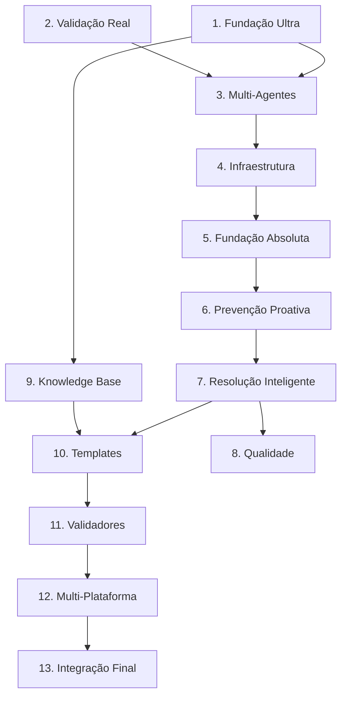

# ROADMAP ULTRA-IA: SISTEMA ULTRA-ESPECIALIZADO

**Versão:** 1.0.0
**Data:** 14 de Janeiro de 2026
**Status:** ATIVO - FASE DE IMPLEMENTAÇÃO
**Objetivo:** Construir o Ultra-IA como um sistema de geração de código ultra-preciso, com validação multi-agente, execução real e zero tolerância a falhas.

---

## 📋 SUMÁRIO EXECUTIVO

Este documento define o plano mestre para a construção do **Ultra-IA**, um sistema de desenvolvimento assistido por inteligência artificial focado em excelência técnica absoluta. A arquitetura é fundamentada em três pilares inegociáveis:

1.  **Fundação de Qualidade Real:** Utilização de *Gold Examples* (exemplos de alta qualidade comprovada) e *RAG* (Retrieval-Augmented Generation) para fundamentar cada linha de código gerada.
2.  **Validação Absoluta:** Verificação de código através de *Execução Real* em ambiente isolado (Docker), *Análise Estática Avançada* (AST/ESLint) e *Fuzzing* para detecção de bordas.
3.  **Inteligência Multi-Perspectiva:** Orquestração de *8 Agentes Especializados* que operam em comitê, com sistema de voto e veto, garantindo que segurança, performance e arquitetura sejam validados simultaneamente.

Este roadmap serve como guia definitivo e autocontido para o desenvolvimento do sistema, contendo todas as especificações, dependências e critérios de aceite necessários.

---

## 🛠️ PRÉ-REQUISITOS TÉCNICOS E AMBIENTE

Para a execução deste roadmap, o ambiente de desenvolvimento deve atender aos seguintes requisitos:

*   **Runtime:** Node.js v18+ (Suporte a ESM obrigatório).
*   **Banco de Dados:** SQLite (via `better-sqlite3`) para Knowledge Base e Contexto.
*   **Containerização:** Docker Engine ativo e configurado (para `DockerSandbox`).
*   **IA/LLM:** Servidor Ollama local ou API compatível rodando (modelos `deepseek-coder`, `llama3`, etc.).
*   **Testes:** Vitest configurado para testes unitários e de integração.
*   **Linter:** ESLint com configurações de segurança e boas práticas.

---

## 🏗️ ESTRUTURA DO ROADMAP

O projeto está dividido em **13 Macro-Etapas** sequenciais. A execução deve respeitar estritamente a ordem de prioridade para garantir a estabilidade arquitetural.

| Prioridade | Macro-Etapa | Foco Principal |
|:---:|:---|:---|
| **MÁXIMA** | [1. Fundação Ultra](#macro-etapa-1-fundação-ultra---gold-examples--rag-real) | Qualidade de Geração e Contexto |
| **MÁXIMA** | [2. Validação Real](#macro-etapa-2-validação-real---execução--fuzzing--static-analysis) | Detecção de Erros e Segurança |
| **MÁXIMA** | [3. Multi-Agentes](#macro-etapa-3-multi-agentes---sistema-de-8-agentes) | Arquitetura e Decisão |
| **ALTA** | [4. Infraestrutura](#macro-etapa-4-infraestrutura-arquitetural) | Base do Sistema e Pipelines |
| **ALTA** | [5. Fundação Absoluta](#macro-etapa-5-fundação-absoluta---sistemas-de-auditoria) | Auditoria e Controle de Qualidade |
| **ALTA** | [6. Prevenção Proativa](#macro-etapa-6-prevenção-proativa) | Antecipação de Falhas |
| **MÉDIA** | [7. Resolução Inteligente](#macro-etapa-7-resolução-inteligente) | Correção Autônoma |
| **MÉDIA** | [8. Qualidade](#macro-etapa-8-qualidade-e-documentação) | Testes e Documentação Técnica |
| **MÉDIA** | [9. Knowledge Base](#macro-etapa-9-knowledge-base-expandida) | Expansão de Conhecimento |
| **MÉDIA** | [10. Templates](#macro-etapa-10-templates-e-geradores) | Padronização de Código |
| **MÉDIA** | [11. Validadores](#macro-etapa-11-validadores-especializados) | Validação por Domínio |
| **BAIXA** | [12. Multi-Plataforma](#macro-etapa-12-multi-plataforma) | Suporte a Múltiplos Ambientes |
| **BAIXA** | [13. Integração Final](#macro-etapa-13-integração-e-testes-finais) | Finalização e Entrega |

---

## DETALHAMENTO TÉCNICO DAS ETAPAS

Cada etapa possui um artefato de entrega definido. O desenvolvedor deve garantir que o artefato atenda à descrição técnica.

### MACRO-ETAPA 1: FUNDAÇÃO ULTRA - Gold Examples + RAG Real
> **Objetivo:** Garantir que o LLM tenha contexto de alta qualidade antes de gerar qualquer código.

| ID | Etapa | Especificação Técnica | Artefato de Entrega |
|:---:|:---|:---|:---|
| **1.1** | **Busca Real de Gold Examples** | Criar `knowledge/GoldExampleSearcher.js`. Implementar busca vetorial/semântica no SQLite para recuperar snippets aprovados relevantes ao prompt. | Classe `GoldExampleSearcher` com método `search(query, limit)` funcional. |
| **1.2** | **Indexação Automática** | Criar `knowledge/GoldExampleIndexer.js`. Sistema que recebe código aprovado, extrai metadados e insere no DB `gold_examples`. | Classe `GoldExampleIndexer` integrando com `DynamicKnowledgeBase`. |
| **1.3** | **Gestão de Anti-Patterns** | Criar `knowledge/AntiPatternManager.js`. CRUD para padrões de código proibidos/ruins para instrução negativa ao LLM. | Classe `AntiPatternManager` com métodos de carga e busca. |
| **1.4** | **RAG Context Enhancement** | Atualizar `HallucinationPreventionGenerator.js`. Injetar Gold Examples e Anti-Patterns no prompt do sistema antes da geração. | Prompt do sistema enriquecido dinamicamente com contexto real. |

### MACRO-ETAPA 2: VALIDAÇÃO REAL - Execução + Fuzzing + Static Analysis
> **Objetivo:** Substituir validações superficiais por ferramentas de engenharia de software reais.

| ID | Etapa | Especificação Técnica | Artefato de Entrega |
|:---:|:---|:---|:---|
| **2.1** | **ESLint/TypeScript Integration** | Criar `validation/ESLintValidator.js`. Executar ESLint programaticamente sobre string de código gerado. | Validador que retorna lista de erros de linting reais. |
| **2.2** | **AST Parser Real** | Criar `validation/ASTParser.js`. Usar `acorn` ou `babel/parser` para validar sintaxe e extrair estrutura sem regex. | Parser que valida sintaxe e retorna árvore AST ou erro estruturado. |
| **2.3** | **Fuzzing System Básico** | Criar `validation/FuzzingSystem.js`. Gerar inputs aleatórios/borda para testar robustez de funções geradas. | Sistema que executa função com N inputs variados e reporta falhas. |
| **2.4** | **Test Runner Automático** | Criar `validation/TestRunnerIntegration.js`. Executar testes (Vitest) dentro do DockerSandbox. | Runner que executa testes gerados e retorna pass/fail estruturado. |
| **2.5** | **Validação Integrada** | Atualizar `MultiLayerValidator.js`. Orquestrar ESLint -> AST -> Execução -> Fuzzing em pipeline. | Pipeline de validação robusto que bloqueia código com erro real. |

### MACRO-ETAPA 3: MULTI-AGENTES - Sistema de 8 Agentes
> **Objetivo:** Criar um "comitê de especialistas" virtual para aprovar código complexo.

| ID | Etapa | Especificação Técnica | Artefato de Entrega |
|:---:|:---|:---|:---|
| **3.1** | **Agent Base Class** | Criar `agents/AgentBase.js`. Classe abstrata com métodos `analyze(context)`, `chat(msg)` e gestão de estado. | Classe base extensível para todos os agentes. |
| **3.2** | **Orquestrador Multi-Agent** | Criar `agents/AgentOrchestrator.js`. Gerencia ciclo de vida, instanciamento e troca de mensagens entre agentes. | Sistema central que coordena a execução paralela/sequencial dos agentes. |
| **3.3** | **Agente Arquiteto** | Especialista em estrutura de arquivos, padrões de projeto e dependências. | `agents/agents/ArchitectAgent.js` implementado. |
| **3.4** | **Agente Coder** | Especialista em implementação de lógica, sintaxe e algoritmos (usa RAG). | `agents/agents/CoderAgent.js` implementado. |
| **3.5** | **Agente Reviewer** | Especialista em Code Review, legibilidade e Clean Code. | `agents/agents/ReviewerAgent.js` implementado. |
| **3.6** | **Agente Tester** | Especialista em criar cenários de teste, mocks e validação de comportamento. | `agents/agents/TesterAgent.js` implementado. |
| **3.7** | **Agente Security** | Especialista em OWASP, sanitização e segurança de dados. | `agents/agents/SecurityAgent.js` implementado. |
| **3.8** | **Agente Performance** | Especialista em Big O, uso de memória e otimização. | `agents/agents/PerformanceAgent.js` implementado. |
| **3.9** | **Agente UX/Intuitivo** | Especialista em usabilidade de API, nomes de variáveis e DX (Developer Experience). | `agents/agents/UXAgent.js` implementado. |
| **3.10** | **Agente Adversário** | "Red Team" virtual. Tenta achar falhas lógicas e edge cases que os outros não viram. | `agents/agents/AdversaryAgent.js` implementado. |
| **3.11** | **Sistema de Consenso** | Criar `agents/ConsensusSystem.js`. Algoritmo de votação que pondera opiniões e decide aprovação/rejeição. | Sistema de decisão que gera veredicto final baseado nos agentes. |

### MACRO-ETAPA 4: INFRAESTRUTURA ARQUITETURAL
> **Objetivo:** Conectar os novos sistemas ao núcleo do Ultra-IA de forma desacoplada.

| ID | Etapa | Especificação Técnica | Artefato de Entrega |
|:---:|:---|:---|:---|
| **4.1** | **Component Registry** | Implementar registro central de dependências (DI Container) em `core/ComponentRegistry.js`. | Container de injeção de dependência funcional. |
| **4.2** | **Base System Interface** | Padronizar interfaces de todos os sistemas (`initialize`, `execute`, `cleanup`). | Interface `BaseSystem.js` implementada e usada. |
| **4.3** | **Config Schema Type-Safe** | Validar `config.json` com Zod para garantir integridade das configurações. | Schema de validação de configuração robusto. |
| **4.4** | **Execution Pipeline** | Criar pipeline que conecta: Entrada -> Agentes -> Validação -> Saída. | Pipeline de execução end-to-end integrando os módulos. |

### MACRO-ETAPA 5: FUNDAÇÃO ABSOLUTA - Sistemas de Auditoria
> **Objetivo:** Garantir rastreabilidade e integridade do processo de geração.

*   **5.1 Baseline de Ambiente:** Captura estado inicial do sistema.
*   **5.2 Anti-Skip Mechanism:** Garante que passos obrigatórios não sejam ignorados.
*   **5.3 Regra dos 3E:** Valida Especificação, Execução e Evidência para cada ação.
*   **5.4 Análise Causa Raiz:** Ferramenta para diagnóstico profundo de erros.
*   **5.5 Verificação Contratos:** Valida interfaces e contratos de API.
*   **5.6 Checkpoints Obrigatórios:** Portões de qualidade que impedem avanço com erros.

### MACRO-ETAPA 6: PREVENÇÃO PROATIVA
> **Objetivo:** Evitar erros antes que eles aconteçam.

*   **6.1 a 6.12:** Conjunto de validadores que analisam decisões, evidências, configurações e tipos antes da execução crítica. Inclui detecção de ambiente e logging estruturado.

### MACRO-ETAPA 7: RESOLUÇÃO INTELIGENTE
> **Objetivo:** Capacidade de auto-correção quando erros ocorrem.

*   **7.1 a 7.6:** Sistemas para resolver erros sequencialmente, calcular scores de qualidade, analisar compatibilidade de ambiente e medir cobertura de testes sobre falhas conhecidas.

### MACRO-ETAPA 8: QUALIDADE E DOCUMENTAÇÃO
> **Objetivo:** Garantir que o produto final seja sustentável.

*   **8.1 a 8.4:** Validação de expectativas de teste, documentação automática precisa e meta-validação (o sistema valida se ele mesmo seguiu o processo).

### MACRO-ETAPA 9: KNOWLEDGE BASE EXPANDIDA
> **Objetivo:** Ensinar ao sistema conceitos avançados específicos.

*   **9.1 a 9.5:** Carga de conhecimento sobre Arquiteturas, Segurança, Integrações, Mobile e Banco de Dados na Knowledge Base.

### MACRO-ETAPA 10: TEMPLATES E GERADORES
> **Objetivo:** Acelerar produção com padrões pré-definidos.

*   **10.1 a 10.6:** Implementação de templates de código para cenários comuns (CRUD, Auth, etc.) e geradores especializados.

### MACRO-ETAPA 11: VALIDADORES ESPECIALIZADOS
> **Objetivo:** Regras de validação específicas por domínio.

*   **11.1 a 11.5:** Validadores focados em Arquitetura, Segurança, Integrações, Mobile e DB.

### MACRO-ETAPA 12: MULTI-PLATAFORMA
> **Objetivo:** Suporte a diferentes ambientes de execução.

*   **12.1 a 12.5:** Detecção e adaptação para Windows/Linux/Mac e Web/Mobile/Desktop.

### MACRO-ETAPA 13: INTEGRAÇÃO E TESTES FINAIS
> **Objetivo:** Validação final do sistema completo.

*   **13.1 a 13.4:** Testes de integração, unitários, regressão e validação do fluxo completo.

---

## CONSOLIDAÇÃO DE CONCEITOS

Para evitar redundância e complexidade desnecessária, os seguintes conceitos foram consolidados na arquitetura:

1.  **Micro-Checkpoints:** Agora são parte integrante do **Checkpoint Manager (5.6)**.
2.  **Agentes Especializados (Antigos):** Substituídos integralmente pelo **Sistema de 8 Agentes (Macro-Etapa 3)**.
3.  **Catálogo de Anti-Padrões:** Integrado ao **AntiPatternManager (1.3)**.

---

## MATRIZ DE DEPENDÊNCIAS DE EXECUÇÃO

O desenvolvimento deve seguir este fluxo de dependência lógica:

---

## CRITÉRIOS DE ACEITE E SUCESSO

O sistema só será considerado pronto quando atingir as seguintes métricas verificáveis:

1.  **Zero Falsos Positivos:** Validação Real deve impedir 100% dos erros de sintaxe e referência antes da entrega ao usuário.
2.  **Cobertura de Testes:** Componentes críticos (Agentes, Validadores) devem ter > 90% de cobertura de código.
3.  **Performance:** Tempo de resposta para geração complexa (Modo Ultra) deve ser aceitável (< 45s) considerando a profundidade da análise.
4.  **Autonomia:** O sistema deve ser capaz de detectar falhas na geração (via validação) e auto-corrigir sem intervenção humana em 95% dos casos.
5.  **Segurança:** Nenhum código com vulnerabilidades conhecidas (OWASP Top 10) deve passar pelos agentes de segurança.
