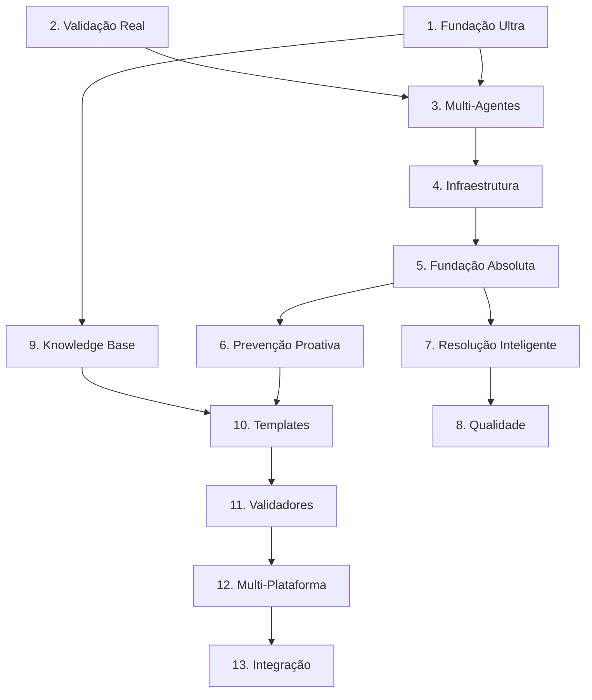

# ROADMAP ULTRA-IA v2.0: SISTEMA ULTRA-ESPECIALIZADO

**Versão:** 2.0.0
**Data:** 14 de Janeiro de 2026
**Status:** ATIVO - FASE DE IMPLEMENTAÇÃO
**Objetivo:** Transformar o Ultra-IA em um sistema de geração de código ultra-preciso, com validação multi-agente, execução real e zero tolerância a falhas.

---

## 📋 SUMÁRIO EXECUTIVO

O **Ultra-IA v2.0** é a evolução definitiva do sistema, focado em três pilares fundamentais que estavam ausentes ou incompletos na versão anterior:

1.  **Fundação de Qualidade Real:** Uso de *Gold Examples* e *RAG* para garantir que o código gerado siga padrões de alta qualidade comprovada.
2.  **Validação Absoluta:** Substituição de validações baseadas em regex por *Execução Real* (Docker), *Análise Estática* (ESLint/AST) e *Fuzzing*.
3.  **Inteligência Multi-Perspectiva:** Implementação de um sistema de *8 Agentes Especializados* que colaboram e votam para garantir a corretude do código sob múltiplos ângulos.

Este roadmap unifica todas as pendências anteriores, integra as descobertas da auditoria forense e estabelece uma ordem estratégica de implementação baseada em dependências técnicas.

---

## 🏗️ ESTRUTURA DO ROADMAP

O roadmap está dividido em **13 Macro-Etapas**, totalizando **77 etapas** específicas. A prioridade é sequencial: as primeiras 3 macro-etapas são a fundação crítica para todo o resto.

| Prioridade | Macro-Etapa | Foco |
|:---:|:---|:---|
| **MÁXIMA** | [1. Fundação Ultra](#macro-etapa-1-fundação-ultra---gold-examples--rag-real) | Qualidade de Geração |
| **MÁXIMA** | [2. Validação Real](#macro-etapa-2-validação-real---execução--fuzzing--static-analysis) | Detecção de Erros |
| **MÁXIMA** | [3. Multi-Agentes](#macro-etapa-3-multi-agentes---sistema-de-8-agentes) | Validação Cruzada |
| **ALTA** | [4. Infraestrutura](#macro-etapa-4-infraestrutura-arquitetural) | Base do Sistema |
| **ALTA** | [5. Fundação Absoluta](#macro-etapa-5-fundação-absoluta---sistemas-de-auditoria) | Auditoria e Controle |
| **ALTA** | [6. Prevenção Proativa](#macro-etapa-6-prevenção-proativa) | Antecipação de Problemas |
| **MÉDIA** | [7. Resolução Inteligente](#macro-etapa-7-resolução-inteligente) | Correção de Erros |
| **MÉDIA** | [8. Qualidade](#macro-etapa-8-qualidade-e-documentação) | Testes e Docs |
| **MÉDIA** | [9. Knowledge Base](#macro-etapa-9-knowledge-base-expandida) | Expansão de Conhecimento |
| **MÉDIA** | [10. Templates](#macro-etapa-10-templates-e-geradores) | Padronização |
| **MÉDIA** | [11. Validadores](#macro-etapa-11-validadores-especializados) | Validação Específica |
| **BAIXA** | [12. Multi-Plataforma](#macro-etapa-12-multi-plataforma) | Suporte Estendido |
| **BAIXA** | [13. Integração Final](#macro-etapa-13-integração-e-testes-finais) | Finalização |

---

## DETALHAMENTO DAS ETAPAS

### MACRO-ETAPA 1: FUNDAÇÃO ULTRA - Gold Examples + RAG Real
> **Objetivo:** Gerar código de alta qualidade usando exemplos reais e evitar anti-padrões conhecidos.

| ID | Etapa | Descrição | Dependências | Prioridade | Esforço |
|:---:|:---|:---|:---:|:---:|:---:|
| **1.1** | **Busca Real de Gold Examples** | Implementar busca semântica de exemplos de código de alta qualidade no SQLite (`knowledge/GoldExampleSearcher.js`). | - | **MÁXIMA** | Médio |
| **1.2** | **Indexação Automática de Exemplos** | Indexar código aprovado automaticamente como gold examples com tokens e metadados (`knowledge/GoldExampleIndexer.js`). | 1.1 | **MÁXIMA** | Médio |
| **1.3** | **Busca de Anti-Patterns** | Implementar `getAntiPatterns()` real para ensinar o sistema o que evitar (`knowledge/AntiPatternManager.js`). | - | **MÁXIMA** | Baixo |
| **1.4** | **RAG Context Enhancement** | Melhorar `buildPrompt()` em `HallucinationPreventionGenerator` para usar gold examples e anti-patterns. | 1.1, 1.3 | **MÁXIMA** | Baixo |

### MACRO-ETAPA 2: VALIDAÇÃO REAL - Execução + Fuzzing + Static Analysis
> **Objetivo:** Detectar erros automaticamente sem custo de tokens LLM, usando ferramentas de mercado.

| ID | Etapa | Descrição | Dependências | Prioridade | Esforço |
|:---:|:---|:---|:---:|:---:|:---:|
| **2.1** | **ESLint/TypeScript Integration** | Integrar ESLint e TypeScript para análise estática profissional em código gerado (`validation/ESLintValidator.js`). | - | **MÁXIMA** | Médio |
| **2.2** | **AST Parser Real** | Parser AST real (acorn/babel) para detectar imports problemáticos, contratos e type safety (`validation/ASTParser.js`). | - | **MÁXIMA** | Alto |
| **2.3** | **Fuzzing System Básico** | Sistema de fuzzing para testar edge cases e inputs inválidos automaticamente (`validation/FuzzingSystem.js`). | 2.4 | **MÁXIMA** | Alto |
| **2.4** | **Test Runner Automático** | Rodar testes gerados no Docker e validar resultados automaticamente (`validation/TestRunnerIntegration.js`). | - | **MÁXIMA** | Médio |
| **2.5** | **Validação Integrada Pipeline** | Integrar ESLint + Execução + Fuzzing no fluxo de validação do `MultiLayerValidator`. | 2.1, 2.4 | **MÁXIMA** | Médio |

### MACRO-ETAPA 3: MULTI-AGENTES - Sistema de 8 Agentes
> **Objetivo:** Validação cruzada multi-perspectiva para garantir zero falhas e cobertura total.

| ID | Etapa | Descrição | Dependências | Prioridade | Esforço |
|:---:|:---|:---|:---:|:---:|:---:|
| **3.1** | **Agent Base Class** | Classe base para todos os agentes com interface padronizada de prompt e resposta (`agents/AgentBase.js`). | - | **MÁXIMA** | Baixo |
| **3.2** | **Orquestrador Multi-Agent** | Coordenador central que gerencia os 8 agentes, fluxo de mensagens e ciclo de vida (`agents/AgentOrchestrator.js`). | 3.1 | **MÁXIMA** | Alto |
| **3.3** | **Agente Arquiteto** | Analisa requisitos, define estrutura de arquivos e identifica dependências do código (`agents/agents/ArchitectAgent.js`). | 3.1 | **MÁXIMA** | Médio |
| **3.4** | **Agente Coder** | Implementa código seguindo padrões definidos e usando gold examples do RAG (`agents/agents/CoderAgent.js`). | 3.1, 1.4 | **MÁXIMA** | Médio |
| **3.5** | **Agente Reviewer** | Revisa código buscando problemas de lógica, legibilidade, manutenção e padrões (`agents/agents/ReviewerAgent.js`). | 3.1 | **MÁXIMA** | Médio |
| **3.6** | **Agente Tester** | Gera testes unitários e de integração para validar comportamento esperado (`agents/agents/TesterAgent.js`). | 3.1 | **MÁXIMA** | Médio |
| **3.7** | **Agente Security** | Auditoria de segurança detectando vulnerabilidades, injeção e secrets expostos (`agents/agents/SecurityAgent.js`). | 3.1 | **MÁXIMA** | Médio |
| **3.8** | **Agente Performance** | Analisa performance, complexidade algorítmica e sugere otimizações (`agents/agents/PerformanceAgent.js`). | 3.1 | **MÁXIMA** | Médio |
| **3.9** | **Agente UX/Intuitivo** | Valida usabilidade da API, nomes de funções e clareza do código gerado (`agents/agents/UXAgent.js`). | 3.1 | **MÁXIMA** | Médio |
| **3.10** | **Agente Adversário** | Tenta "quebrar" o código com inputs maliciosos e edge cases lógicos (`agents/agents/AdversaryAgent.js`). | 3.1 | **MÁXIMA** | Médio |
| **3.11** | **Sistema de Consenso** | Votação ponderada com poder de veto para agentes críticos (Security, Tester) (`agents/ConsensusSystem.js`). | 3.2 | **MÁXIMA** | Alto |

### MACRO-ETAPA 4: INFRAESTRUTURA ARQUITETURAL
> **Objetivo:** Base arquitetural robusta para suportar todos os sistemas integrados.

| ID | Etapa | Descrição | Dependências | Prioridade | Esforço |
|:---:|:---|:---|:---:|:---:|:---:|
| **4.1** | **Component Registry** | Sistema de registro e descoberta de componentes com resolução automática de dependências. | - | **ALTA** | Médio |
| **4.2** | **Base System Interface** | Interface base padronizada para todos os sistemas do Ultra-IA (`BaseSystem.js`). | - | **ALTA** | Baixo |
| **4.3** | **Config Schema Type-Safe** | Configuração extensível e validada com Zod para todos os sistemas (`ConfigSchema.js`). | - | **ALTA** | Médio |
| **4.4** | **Execution Pipeline** | Pipeline de execução ordenada respeitando dependências entre sistemas (`ExecutionPipeline.js`). | 4.1 | **ALTA** | Alto |

### MACRO-ETAPA 5: FUNDAÇÃO ABSOLUTA - Sistemas de Auditoria
> **Objetivo:** Garantir certeza absoluta e eliminação de falsos positivos através de auditoria rigorosa.

| ID | Etapa | Descrição | Dependências | Prioridade | Esforço |
|:---:|:---|:---|:---:|:---:|:---:|
| **5.1** | **Baseline de Ambiente** | Documentar estado inicial do ambiente para reprodução e debugging (`BaselineManager.js`). | - | **ALTA** | Médio |
| **5.2** | **Anti-Skip Mechanism** | Prevenir pulo de checks obrigatórios com bloqueio automático de progresso (`AntiSkipMechanism.js`). | - | **ALTA** | Baixo |
| **5.3** | **Regra dos 3E** | Validar obrigatoriamente Especificação + Execução + Evidência em cada check (`ThreeERuleValidator.js`). | - | **ALTA** | Baixo |
| **5.4** | **Análise Causa Raiz** | Identificar todas as causas raiz com certeza absoluta sem falsos positivos (`AbsoluteCertaintyAnalyzer.js`). | 5.1 | **ALTA** | Alto |
| **5.5** | **Verificação Contratos** | Verificar contratos completos e analisar dependências transitivas (`CompleteContractAnalyzer.js`). | 5.1 | **ALTA** | Médio |
| **5.6** | **Checkpoints Obrigatórios** | Estruturar processo com 5 portões de qualidade bloqueantes (`CheckpointManager.js`). | 5.2 | **ALTA** | Médio |

### MACRO-ETAPA 6: PREVENÇÃO PROATIVA
> **Objetivo:** Antecipar problemas antes que ocorram durante o desenvolvimento.

| ID | Etapa | Descrição | Dependências | Prioridade | Esforço |
|:---:|:---|:---|:---:|:---:|:---:|
| **6.1** | **Classificação de Decisões** | Classificar decisões em Níveis 1, 2, 3 com ação apropriada para cada nível. | - | **ALTA** | Baixo |
| **6.2** | **Níveis de Evidência** | Validar nível de evidência adequado à severidade do check (Mínima a Completa). | 5.1 | **ALTA** | Médio |
| **6.3** | **Antecipação Proativa** | Detectar padrões problemáticos e prever problemas futuros em tempo real. | 5.1 | **ALTA** | Alto |
| **6.4** | **Geração com Validação Inline** | Gerar código com validação e auto-correção durante a própria geração. | 5.3 | **ALTA** | Alto |
| **6.5** | **Chain-of-Thought Obrigatório** | Garantir raciocínio explícito e rastreável em formato estruturado obrigatório. | 5.3 | **ALTA** | Baixo |
| **6.6** | **Validação de Configuração** | Validar configurações de build, SDK e caminhos antes de permitir commit. | 5.1 | **ALTA** | Médio |
| **6.7** | **Cadeia de Evidência** | Transformar evidência bruta em cadeia rastreável com metadados completos. | 5.1 | **ALTA** | Médio |
| **6.8** | **Matriz de Rastreabilidade** | Mapear requisito para artefato para teste para evidência em matriz unificada. | 6.7 | **ALTA** | Médio |
| **6.9** | **Validação Error Handling** | Detector de catch blocks vazios e console.log em produção. | - | **ALTA** | Baixo |
| **6.10** | **Detecção de Ambiente** | Detectar Node.js, Python, Docker disponíveis com fallbacks automáticos. | - | **ALTA** | Baixo |
| **6.11** | **Validação de Logging** | Validar uso de logger estruturado em vez de console.log. | - | **ALTA** | Baixo |
| **6.12** | **Validação de Tipos** | Detectar uso de `any` e inferir tipos do contexto para sugerir correções. | - | **ALTA** | Médio |

### MACRO-ETAPA 7: RESOLUÇÃO INTELIGENTE
> **Objetivo:** Resolver erros sem causar impacto negativo e calcular métricas precisas.

| ID | Etapa | Descrição | Dependências | Prioridade | Esforço |
|:---:|:---|:---|:---:|:---:|:---:|
| **7.1** | **Resolução Sequencial** | Resolver erros em ordem estratégica com análise de impacto em cascata. | 5.1 | **MÉDIA** | Alto |
| **7.2** | **Cálculo de Score** | Calcular score exato seguindo fórmula S = (Passando / Aplicáveis) x 100. | 5.1 | **MÉDIA** | Médio |
| **7.3** | **Compatibilidade Multi-Ambiente** | Analisar compatibilidade entre runtimes Node.js, Deno, Browser e SDKs. | 5.1 | **MÉDIA** | Alto |
| **7.4** | **Análise Forense** | Identificar causa raiz com classificação de erros e padrões conhecidos. | 5.1 | **MÉDIA** | Médio |
| **7.5** | **Resolução em Lote** | Resolver múltiplos erros relacionados em uma única análise. | 7.1 | **MÉDIA** | Médio |
| **7.6** | **Cálculo de Cobertura** | Calcular cobertura matemática formal de classes de falha (Universo U). | 5.1 | **MÉDIA** | Alto |

### MACRO-ETAPA 8: QUALIDADE E DOCUMENTAÇÃO
> **Objetivo:** Garantir qualidade de testes e documentação precisa.

| ID | Etapa | Descrição | Dependências | Prioridade | Esforço |
|:---:|:---|:---|:---:|:---:|:---:|
| **8.1** | **Validação de Expectativas** | Validar expectativas de testes antes de escrever com isolamento completo. | 5.3 | **MÉDIA** | Alto |
| **8.2** | **Validação de Testes** | Validar que testes estão corretos, atualizados e mocks correspondem à realidade. | 8.1 | **MÉDIA** | Médio |
| **8.3** | **Documentação Precisa** | Manter documentação atualizada com validação cross-reference de evidências. | 6.7 | **MÉDIA** | Médio |
| **8.4** | **Meta-Validação** | Validar a própria auditoria com checklist de 18 itens obrigatórios. | Todos | **MÉDIA** | Médio |

### MACRO-ETAPA 9: KNOWLEDGE BASE EXPANDIDA
> **Objetivo:** Expandir conhecimento para trabalhar em qualquer sistema NexoPro.

| ID | Etapa | Descrição | Dependências | Prioridade | Esforço |
|:---:|:---|:---|:---:|:---:|:---:|
| **9.1** | **Conhecimento Arquiteturas** | Clean Architecture, Repository Pattern, Use Cases, DDD com exemplos. | - | **MÉDIA** | Médio |
| **9.2** | **Conhecimento Segurança** | E2E Encryption, OAuth 2.0, RLS, Device Binding com exemplos práticos. | - | **MÉDIA** | Médio |
| **9.3** | **Conhecimento Integrações** | Facebook Graph API, Instagram, Google APIs, Webhooks com exemplos. | - | **MÉDIA** | Médio |
| **9.4** | **Conhecimento Mobile** | Expo Router, WatermelonDB, Offline-first, React Native performance. | - | **MÉDIA** | Médio |
| **9.5** | **Conhecimento Banco de Dados** | PostgreSQL avançado, migrations, RLS, performance e JSONB. | - | **MÉDIA** | Médio |

### MACRO-ETAPA 10: TEMPLATES E GERADORES
> **Objetivo:** Geração rápida de código padronizado.

| ID | Etapa | Descrição | Dependências | Prioridade | Esforço |
|:---:|:---|:---|:---:|:---:|:---:|
| **10.1** | **Templates Arquitetura** | Domain Entity, Use Case, Repository, Controller, Application Service. | - | **MÉDIA** | Médio |
| **10.2** | **Templates Segurança** | E2E Encryption, OAuth Handler, JWT Middleware, RLS Policy. | - | **MÉDIA** | Médio |
| **10.3** | **Templates Integrações** | Webhook Handler, OAuth Callback, API Client, Error Handler. | - | **MÉDIA** | Médio |
| **10.4** | **Templates Mobile** | Expo Screen, WatermelonDB Model, Sync Service, Offline Queue. | - | **MÉDIA** | Médio |
| **10.5** | **Templates Database** | Migration, RLS Policy, Query Otimizada, Index. | - | **MÉDIA** | Médio |
| **10.6** | **Geradores Especializados** | Gerar código usando templates por domínio automaticamente. | 10.1-5 | **MÉDIA** | Alto |

### MACRO-ETAPA 11: VALIDADORES ESPECIALIZADOS
> **Objetivo:** Validação profunda por domínio.

| ID | Etapa | Descrição | Dependências | Prioridade | Esforço |
|:---:|:---|:---|:---:|:---:|:---:|
| **11.1** | **Validador Arquitetura** | Validar Clean Architecture, dependências entre camadas e responsabilidades. | - | **MÉDIA** | Alto |
| **11.2** | **Validador Segurança Avançada** | Validar E2E Encryption, OAuth flows, RLS policies, Device Binding. | - | **MÉDIA** | Médio |
| **11.3** | **Validador Integrações** | Validar Webhooks, OAuth callbacks, API clients, error handling. | - | **MÉDIA** | Médio |
| **11.4** | **Validador Mobile** | Validar Expo Router, WatermelonDB, Offline-first, React Native performance. | - | **MÉDIA** | Médio |
| **11.5** | **Validador Database** | Validar Migrations, RLS policies, performance queries, índices. | - | **MÉDIA** | Médio |

### MACRO-ETAPA 12: MULTI-PLATAFORMA
> **Objetivo:** Suporte completo para todas as plataformas.

| ID | Etapa | Descrição | Dependências | Prioridade | Esforço |
|:---:|:---|:---|:---:|:---:|:---:|
| **12.1** | **Platform Detector** | Detectar plataforma Windows, Linux, macOS automaticamente. | - | **BAIXA** | Baixo |
| **12.2** | **Suporte Desktop** | Gerar e validar código específico por plataforma desktop. | 12.1 | **BAIXA** | Médio |
| **12.3** | **Suporte Web** | Navegadores, responsividade, acessibilidade WCAG com browser automation. | - | **BAIXA** | Médio |
| **12.4** | **Suporte Mobile** | Android e iOS com suporte a emuladores para testes. | - | **BAIXA** | Alto |
| **12.5** | **Cross-Platform** | Código compartilhado e testes em múltiplas plataformas. | 12.1 | **BAIXA** | Alto |

### MACRO-ETAPA 13: INTEGRAÇÃO E TESTES FINAIS
> **Objetivo:** Integrar e testar extensivamente todo o ecossistema.

| ID | Etapa | Descrição | Dependências | Prioridade | Esforço |
|:---:|:---|:---|:---:|:---:|:---:|
| **13.1** | **Integração Completa** | Integrar todos validadores, geradores, estratégias e multi-plataforma. | Todos | **BAIXA** | Alto |
| **13.2** | **Testes Unitários** | Testes para cada componente com cobertura mínima de 90%. | - | **BAIXA** | Médio |
| **13.3** | **Testes Integração** | Testes end-to-end com sistemas reais, performance e segurança. | - | **BAIXA** | Alto |
| **13.4** | **Testes Regressão** | Prevenir erros conhecidos e garantir compatibilidade com melhorias. | - | **BAIXA** | Médio |

---

## ITENS CONSOLIDADOS (NÃO REMOVER)

Alguns itens sugeridos anteriormente foram consolidados em sistemas mais robustos:

1.  **Sistema de Micro-Checkpoints:** Consolidado dentro de **Checkpoints Obrigatórios (5.6)**.
2.  **Sistema de Agentes Especializados (6 agentes):** Substituído pelo **Sistema de 8 Agentes Multi-Agent (Macro-Etapa 3)**.
3.  **Catálogo de Anti-Padrões:** Integrado ao **AntiPatternManager (1.3)** e **Knowledge Base (Macro-Etapa 9)**.

---

## MATRIZ DE DEPENDÊNCIAS MACRO

---

## MÉTRICAS DE SUCESSO

Para considerar este roadmap concluído, as seguintes métricas devem ser atingidas:

1.  **Zero Falsos Positivos:** Identificação de erros com certeza absoluta.
2.  **Cobertura de Testes > 90%:** Em todos os componentes críticos.
3.  **Tempo de Geração < 30s:** Para requisições padrão (Modo Standard).
4.  **Taxa de Aprovação > 95%:** Código gerado aceito sem necessidade de intervenção manual.
5.  **Imunidade a Erros Conhecidos:** 100% dos erros históricos prevenidos.
