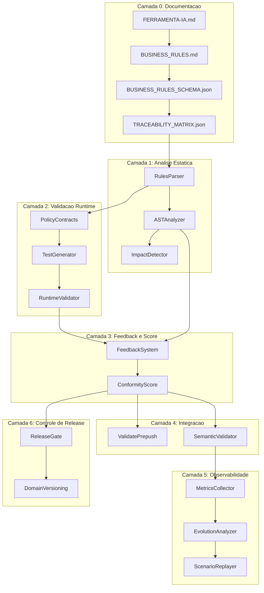
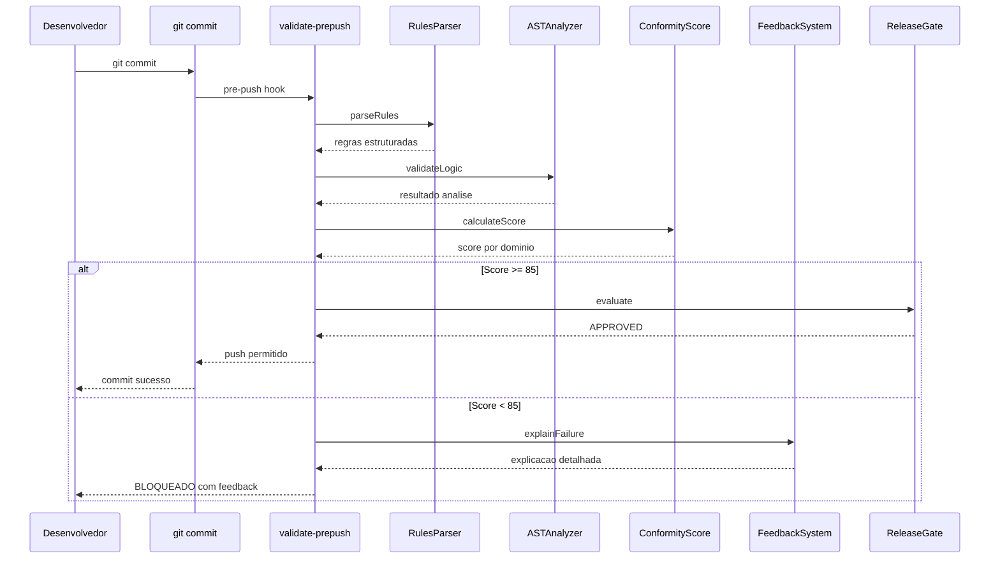

# FERRAMENTA-IA: Sistema Inteligente de Validação de Lógica de Negócio

## Glossário de Termos

| Termo | Definição |

|-------|-----------|

| **AST** | Abstract Syntax Tree - representação estruturada do código que permite análise semântica |

| **Policy-as-Code** | Regras de negócio expressas como código verificável em runtime |

| **Rastreabilidade** | Vínculo explícito entre requisito, código, teste e métrica |

| **Score de Conformidade** | Métrica quantitativa (0-100) indicando aderência às regras de negócio |

| **Gate de Release** | Ponto de decisão automatizado que aprova ou bloqueia deploy |

| **Contrato** | Especificação de pré-condições e pós-condições de uma operação |

| **Validação Estática** | Análise de código sem execução (em tempo de build) |

| **Validação Runtime** | Verificação durante execução real do sistema |

---

## ROADMAP DE IMPLEMENTAÇÃO

1. **Documento FERRAMENTA-IA principal com arquitetura e padrões**
2. **Schema JSON executável para regras de negócio**
3. **Matriz de rastreabilidade vinculando regras a código e testes**
4. **Parser de regras com cache inteligente e validação**
5. **Motor de análise AST para validação semântica de código**
6. **Detector de impacto baseado em git diff e grafo de dependências**
7. **Contratos de negócio verificáveis em runtime**
8. **Gerador automático de testes a partir de regras documentadas**
9. **Executor de testes runtime com validação de contratos**
10. **Sistema de feedback inteligente com explicações e sugestões**
11. **Calculador de score de conformidade por domínio**
12. **Integração com sistema de validação existente**
13. **Coletor de métricas e alertas de violação em produção**
14. **Analisador de evolução baseado em histórico git**
15. **Reprodutor de cenários reais anonimizados**
16. **Gate de release com bloqueio por risco e aprovação por score**
17. **Versionador de modelos de domínio com migração segura**
18. **Workflow CI/CD completo para validação automatizada**

---

## ARQUITETURA COMPLETA



### Fluxo Completo do Desenvolvedor



---

## ESTRUTURA DE ARQUIVOS

```
docs/
  FERRAMENTA-IA.md                          # Documento principal (este plano executavel)
  BUSINESS_RULES.md                    # Regras de negocio estruturadas
  BUSINESS_RULES_SCHEMA.json           # Schema JSON validador
  TRACEABILITY_MATRIX.json             # Matriz de rastreabilidade

scripts/validation/
  _types.js                            # Tipos compartilhados (JSDoc)
  _constants.js                        # Constantes e thresholds
  _logger.js                           # Sistema de logs estruturados
  _ast-analyzer.js                     # Motor de analise AST
  _impact-detector.js                  # Detector de impacto git
  _rules-parser.js                     # Parser de BUSINESS_RULES.md
  _feedback.js                         # Sistema de feedback inteligente
  _policy-contracts.js                 # Contratos de negocio runtime
  _conformity-score.js                 # Calculador de score
  _test-generator.js                   # Gerador automatico de testes
  _evolution-analyzer.js               # Analisador de evolucao
  _scenario-replayer.js                # Reprodutor de cenarios
  validate-business-rules-semantic.js  # Validacao semantica integrada

__tests__/
  FERRAMENTA-IA/                            # Testes do proprio FERRAMENTA-IA
    rules-parser.test.js
    ast-analyzer.test.js
    feedback.test.js
    conformity-score.test.js
  integration/
    business-rules-runtime.test.ts     # Testes runtime de regras
    generated/                         # Testes auto-gerados

lib/FERRAMENTA-IA/
  index.ts                             # Ponto de entrada
  types.ts                             # Tipos TypeScript
  metrics.ts                           # Metricas e alertas
  release-gate.ts                      # Gate de release
  domain-versioning.ts                 # Versionamento de dominio

.github/workflows/
  FERRAMENTA-IA-validation.yml              # Workflow CI/CD completo
```

---

## TIPOS COMPARTILHADOS

**Arquivo:** `scripts/validation/_types.js`

```javascript
/**
 * @typedef {Object} Rule
 * @property {string} id - Identificador unico (ex: REGRA-001)
 * @property {string} name - Nome descritivo
 * @property {'CRITICA'|'ALTA'|'MEDIA'|'BAIXA'} priority
 * @property {string} category - Dominio (Auth, Sync, Email, etc)
 * @property {string} description
 * @property {Implementation} implementation
 * @property {Validation} validation
 * @property {Example[]} examples
 */

/**
 * @typedef {Object} Implementation
 * @property {string[]} codeFiles - Arquivos que implementam
 * @property {string[]} testFiles - Arquivos de teste
 * @property {string[]} validationScripts - Scripts de validacao
 */

/**
 * @typedef {Object} ValidationResult
 * @property {string} ruleId
 * @property {'PASS'|'FAIL'|'SKIP'|'ERROR'} status
 * @property {string} message
 * @property {string[]} details
 * @property {Suggestion[]} suggestions
 * @property {number} executionTimeMs
 */

/**
 * @typedef {Object} ConformityScore
 * @property {number} overall - Score geral (0-100)
 * @property {Object.<string, number>} byDomain - Score por dominio
 * @property {Object.<string, number>} byPriority - Score por prioridade
 * @property {Rule[]} failures - Regras que falharam
 * @property {Rule[]} warnings - Regras com alertas
 */

/**
 * @typedef {Object} Feedback
 * @property {string} ruleId
 * @property {string} ruleName
 * @property {string} problem - Descricao do problema
 * @property {string} cause - Causa raiz
 * @property {string} solution - Solucao sugerida
 * @property {string} codeExample - Exemplo de codigo correto
 * @property {string} documentationLink - Link para docs
 */
```

---

## CONSTANTES E THRESHOLDS

**Arquivo:** `scripts/validation/_constants.js`

```javascript
module.exports = {
  // Thresholds de score
  SCORE_THRESHOLDS: {
    RELEASE_BLOCK: 70,      // Abaixo disso, bloqueia release
    RELEASE_WARN: 85,       // Abaixo disso, alerta
    RELEASE_APPROVE: 95     // Acima disso, aprovacao automatica
  },

  // Pesos por prioridade
  PRIORITY_WEIGHTS: {
    CRITICA: 10,
    ALTA: 5,
    MEDIA: 2,
    BAIXA: 1
  },

  // Dominios conhecidos
  DOMAINS: ['Auth', 'Sync', 'Email', 'Conversation', 'Template', 'Settings'],

  // Limites de performance
  PERFORMANCE: {
    MAX_PARSE_TIME_MS: 1000,
    MAX_AST_ANALYSIS_TIME_MS: 5000,
    MAX_TOTAL_VALIDATION_TIME_MS: 30000,
    MAX_FILE_SIZE_BYTES: 500000
  },

  // Padroes de log
  LOG_LEVELS: {
    ERROR: 0,
    WARN: 1,
    INFO: 2,
    DEBUG: 3
  }
};
```

---

## FASE 1: DOCUMENTAÇÃO PRINCIPAL

### Item 1.1: Documento FERRAMENTA-IA.md

**Arquivo:** `docs/FERRAMENTA-IA.md`

**O que fazer:**

- Criar documento central que serve como ponto de entrada
- Incluir visão geral, arquitetura, glossário
- Referenciar todos os outros documentos e scripts
- Manter como "single source of truth" para desenvolvedores

**Cuidados:**

- Manter atualizado conforme sistema evolui
- Incluir changelog de versões do FERRAMENTA-IA
- Não duplicar informação que está em outros docs

**Critérios de Aceitação:**

- Desenvolvedor novo consegue entender sistema lendo apenas este doc
- Todas as referências a arquivos existem e estão corretas
- Diagrama de arquitetura reflete estado real

---

### Item 1.2: Schema JSON Executável

**Arquivo:** `docs/BUSINESS_RULES_SCHEMA.json`

**O que fazer:**

- Criar JSON Schema que valida estrutura de BUSINESS_RULES.md
- Definir campos obrigatórios: id, prioridade, categoria, implementação
- Incluir enums: prioridades, status, categorias
- Permitir extensão para novas categorias

**Estrutura completa:**

```json
{
  "$schema": "http://json-schema.org/draft-07/schema#",
  "type": "object",
  "required": ["version", "rules"],
  "properties": {
    "version": { "type": "string", "pattern": "^\\d+\\.\\d+\\.\\d+$" },
    "rules": {
      "type": "array",
      "items": {
        "type": "object",
        "required": ["id", "name", "priority", "category", "description", "implementation"],
        "properties": {
          "id": { "type": "string", "pattern": "^REGRA-\\d{3}$" },
          "name": { "type": "string", "maxLength": 100 },
          "priority": { "enum": ["CRITICA", "ALTA", "MEDIA", "BAIXA"] },
          "category": { "enum": ["Auth", "Sync", "Email", "Conversation", "Template", "Settings"] },
          "description": { "type": "string" },
          "implementation": {
            "type": "object",
            "required": ["codeFiles"],
            "properties": {
              "codeFiles": { "type": "array", "items": { "type": "string" }, "minItems": 1 },
              "testFiles": { "type": "array", "items": { "type": "string" } },
              "validationScripts": { "type": "array", "items": { "type": "string" } }
            }
          }
        }
      }
    }
  }
}
```

**Cuidados:**

- Schema deve ser backward compatible em novas versões
- Validar unicidade de IDs
- Validar que arquivos referenciados existem

**Antecipação de Erros:**

- Regras sem ID único: validar unicidade no parser
- Campos ausentes: schema rejeita com mensagem clara
- Formato inconsistente: normalizar via parser

**Critérios de Aceitação:**

- `ajv validate --spec=draft7 BUSINESS_RULES_SCHEMA.json` passa
- Parser valida BUSINESS_RULES.md contra schema sem erros
- Novas regras adicionadas são validadas automaticamente

---

### Item 1.3: Matriz de Rastreabilidade

**Arquivo:** `docs/TRACEABILITY_MATRIX.json`

**O que fazer:**

- Criar matriz JSON vinculando regra → código → teste → métrica
- Automatizar geração via script
- Incluir status de cobertura por tipo de validação

**Estrutura completa:**

```json
{
  "version": "1.0.0",
  "generated_at": "2025-01-15T00:00:00Z",
  "summary": {
    "total_rules": 14,
    "with_static_coverage": 14,
    "with_runtime_coverage": 8,
    "with_production_metrics": 5
  },
  "rules": [
    {
      "id": "REGRA-001",
      "name": "Email Único por Usuário",
      "priority": "CRITICA",
      "code_files": ["services/AuthService.ts:45-89"],
      "test_files": ["__tests__/services/AuthService.test.ts"],
      "validation_scripts": ["scripts/validation/validate-business-rules.js"],
      "metrics": {
        "names": ["auth.signup.success", "auth.signup.duplicate_blocked"],
        "alerts": ["auth.signup.failure_rate > 5%"]
      },
      "coverage": {
        "static": { "status": true, "last_validated": "2025-01-15" },
        "runtime": { "status": true, "last_executed": "2025-01-15" },
        "production": { "status": false, "reason": "metrics not configured" }
      },
      "dependencies": ["REGRA-002", "REGRA-003"],
      "impacted_by_files": ["services/AuthService.ts", "supabase/functions/auth/*"]
    }
  ]
}
```

**Cuidados:**

- Matriz DEVE ser gerada automaticamente, nunca editada manualmente
- Detectar arquivos ausentes ou renomeados
- Alertar sobre regras sem cobertura

**Antecipação de Erros:**

- Arquivo de código renomeado: alerta de rastreabilidade quebrada
- Teste deletado: alerta de cobertura perdida
- Dependência circular: detectar e reportar

**Critérios de Aceitação:**

- Matriz gerada em < 2 segundos
- 100% das regras CRÍTICAS com rastreabilidade completa
- Script de geração integrado ao pre-push hook

---

## FASE 2: ANÁLISE ESTÁTICA

### Item 2.1: Sistema de Logs Estruturados

**Arquivo:** `scripts/validation/_logger.js`

**O que fazer:**

- Criar logger padronizado para todos os scripts FERRAMENTA-IA
- Suporte a níveis (ERROR, WARN, INFO, DEBUG)
- Formato estruturado (JSON) para análise posterior
- Prefixo [FERRAMENTA-IA] para identificação

**Interface:**

```javascript
// _logger.js
const CONSTANTS = require('./_constants');

const logger = {
  error: (component, message, data = {}) => log('ERROR', component, message, data),
  warn: (component, message, data = {}) => log('WARN', component, message, data),
  info: (component, message, data = {}) => log('INFO', component, message, data),
  debug: (component, message, data = {}) => log('DEBUG', component, message, data),
  
  // Log de validação específico
  validation: (ruleId, status, details) => {
    const icon = status === 'PASS' ? '✓' : status === 'FAIL' ? '✗' : '⚠';
    console.log(`[FERRAMENTA-IA] ${icon} ${ruleId}: ${details}`);
  },
  
  // Grupo de logs para uma fase
  startPhase: (name) => console.log(`\n[FERRAMENTA-IA] ═══ ${name} ═══`),
  endPhase: (name, success) => console.log(`[FERRAMENTA-IA] ═══ ${name}: ${success ? 'OK' : 'FALHOU'} ═══\n`)
};

function log(level, component, message, data) {
  const timestamp = new Date().toISOString();
  const logData = { timestamp, level, component, message, ...data };
  
  if (process.env.FERRAMENTA_IA_LOG_JSON === 'true') {
    console.log(JSON.stringify(logData));
  } else {
    const levelIcon = { ERROR: '🔴', WARN: '🟡', INFO: '🔵', DEBUG: '⚪' }[level];
    console.log(`[FERRAMENTA-IA] ${levelIcon} [${component}] ${message}`);
  }
}

module.exports = logger;
```

**Cuidados:**

- Não logar informações sensíveis
- Manter performance (log assíncrono se necessário)
- Permitir desabilitar debug em produção

---

### Item 2.2: Parser de Regras

**Arquivo:** `scripts/validation/_rules-parser.js`

**O que fazer:**

- Parser que lê BUSINESS_RULES.md e extrai regras estruturadas
- Validar contra BUSINESS_RULES_SCHEMA.json
- Cache com invalidação por hash do arquivo
- Exportar funções utilitárias

**Interface completa:**

```javascript
// _rules-parser.js
const fs = require('fs');
const crypto = require('crypto');
const Ajv = require('ajv');
const logger = require('./_logger');

let cache = { hash: null, rules: null };

module.exports = {
  /**
   * Parseia BUSINESS_RULES.md e retorna array de regras
   * @returns {Rule[]}
   */
  parseRules: () => {
    const content = fs.readFileSync('docs/BUSINESS_RULES.md', 'utf-8');
    const hash = crypto.createHash('md5').update(content).digest('hex');
    
    if (cache.hash === hash) {
      logger.debug('RulesParser', 'Usando cache');
      return cache.rules;
    }
    
    const rules = extractRulesFromMarkdown(content);
    cache = { hash, rules };
    return rules;
  },

  getRuleById: (id) => { /* ... */ },
  getRulesByCategory: (category) => { /* ... */ },
  getRulesByPriority: (priority) => { /* ... */ },
  
  /**
   * Valida regras contra schema JSON
   * @returns {{valid: boolean, errors: string[]}}
   */
  validateRulesSchema: () => {
    const ajv = new Ajv();
    const schema = JSON.parse(fs.readFileSync('docs/BUSINESS_RULES_SCHEMA.json', 'utf-8'));
    const rules = module.exports.parseRules();
    const validate = ajv.compile(schema);
    const valid = validate({ version: '1.0.0', rules });
    return { valid, errors: validate.errors || [] };
  },

  /**
   * Invalida cache (para testes)
   */
  invalidateCache: () => { cache = { hash: null, rules: null }; }
};
```

**Cuidados:**

- Cache invalidado automaticamente quando arquivo muda
- Logs claros de erros de parse
- Tratamento de markdown malformado

**Antecipação de Erros:**

- Arquivo não encontrado: erro claro com path esperado
- Markdown malformado: parser resiliente, reporta seções problemáticas
- Schema inválido: erro antes de continuar validação

**Critérios de Aceitação:**

- Parse de 50 regras em < 500ms
- Cache funciona (segunda chamada < 10ms)
- Todas as regras de BUSINESS_RULES.md extraídas corretamente

---

### Item 2.3: Motor de Análise AST

**Arquivo:** `scripts/validation/_ast-analyzer.js`

**O que fazer:**

- Usar @babel/parser para parsing de TypeScript/JavaScript
- Usar @babel/traverse para navegação semântica
- Implementar funções de busca específicas para validação de regras
- Cache de AST por arquivo

**Dependências:**

```bash
npm install --save-dev @babel/parser@^7.23.0 @babel/traverse@^7.23.0 @babel/types@^7.23.0
```

**Interface completa:**

```javascript
// _ast-analyzer.js
const parser = require('@babel/parser');
const traverse = require('@babel/traverse').default;
const t = require('@babel/types');
const fs = require('fs');
const crypto = require('crypto');
const logger = require('./_logger');
const CONSTANTS = require('./_constants');

const astCache = new Map();

module.exports = {
  /**
   * Parseia arquivo e retorna AST
   * @param {string} filePath
   * @returns {AST|null}
   */
  parseFile: (filePath) => {
    const stats = fs.statSync(filePath);
    if (stats.size > CONSTANTS.PERFORMANCE.MAX_FILE_SIZE_BYTES) {
      logger.warn('ASTAnalyzer', `Arquivo muito grande: ${filePath}`);
      return null;
    }
    
    const content = fs.readFileSync(filePath, 'utf-8');
    const hash = crypto.createHash('md5').update(content).digest('hex');
    
    if (astCache.has(filePath) && astCache.get(filePath).hash === hash) {
      return astCache.get(filePath).ast;
    }
    
    try {
      const ast = parser.parse(content, {
        sourceType: 'module',
        plugins: ['typescript', 'jsx', 'decorators-legacy']
      });
      astCache.set(filePath, { hash, ast });
      return ast;
    } catch (error) {
      logger.error('ASTAnalyzer', `Erro ao parsear ${filePath}`, { error: error.message });
      return null;
    }
  },

  /**
   * Encontra chamadas de função específica
   */
  findFunctionCalls: (ast, functionName) => {
    const calls = [];
    traverse(ast, {
      CallExpression(path) {
        if (path.node.callee.name === functionName ||
            (path.node.callee.property && path.node.callee.property.name === functionName)) {
          calls.push({
            line: path.node.loc.start.line,
            arguments: path.node.arguments.length
          });
        }
      }
    });
    return calls;
  },

  /**
   * Encontra verificações condicionais de variável
   */
  findConditionalChecks: (ast, variableName) => { /* ... */ },

  /**
   * Encontra throws de erro específico
   */
  findThrowStatements: (ast, errorType) => { /* ... */ },

  /**
   * Rastreia fluxo de dados de variável
   */
  traceDataFlow: (ast, variableName) => { /* ... */ },

  /**
   * Valida lógica conforme especificação da regra
   * @param {AST} ast
   * @param {RuleSpec} ruleSpec - Especificação do que validar
   * @returns {ValidationResult}
   */
  validateLogic: (ast, ruleSpec) => {
    const result = { ruleId: ruleSpec.id, status: 'PASS', details: [] };
    
    // Verifica cada asserção da regra
    for (const assertion of ruleSpec.assertions) {
      switch (assertion.type) {
        case 'function_exists':
          const calls = module.exports.findFunctionCalls(ast, assertion.name);
          if (calls.length === 0) {
            result.status = 'FAIL';
            result.details.push(`Função ${assertion.name} não encontrada`);
          }
          break;
        case 'check_before_operation':
          // Verifica se há verificação antes de operação
          break;
        // ... outros tipos de asserção
      }
    }
    
    return result;
  },

  /**
   * Limpa cache (para testes)
   */
  clearCache: () => astCache.clear()
};
```

**Cuidados:**

- Cache por hash do arquivo
- Tratamento de erros de sintaxe
- Limite de tamanho de arquivo
- Timeout para análises longas

**Antecipação de Erros:**

- Sintaxe inválida: retorna null com log de erro, não crasha
- Arquivo muito grande: skip com warning
- Import circular: detectar profundidade máxima

**Critérios de Aceitação:**

- Parse de arquivo 1000 linhas em < 500ms
- Cache funciona corretamente
- Detecta funções, condicionais e throws

---

### Item 2.4: Detector de Impacto

**Arquivo:** `scripts/validation/_impact-detector.js`

**O que fazer:**

- Analisar git diff para detectar arquivos modificados
- Mapear arquivos para regras afetadas via matriz
- Gerar relatório de impacto

**Interface:**

```javascript
// _impact-detector.js
const { execSync } = require('child_process');
const rulesParser = require('./_rules-parser');
const logger = require('./_logger');

module.exports = {
  /**
   * Retorna arquivos modificados desde último commit
   */
  getChangedFiles: (base = 'HEAD~1') => {
    try {
      const output = execSync(`git diff --name-only ${base}`, { encoding: 'utf-8' });
      return output.trim().split('\n').filter(Boolean);
    } catch (error) {
      logger.error('ImpactDetector', 'Erro ao obter git diff', { error: error.message });
      return [];
    }
  },

  /**
   * Retorna regras afetadas pelos arquivos modificados
   */
  getAffectedRules: (changedFiles) => {
    const matrix = require('../../docs/TRACEABILITY_MATRIX.json');
    const affected = new Set();
    
    for (const file of changedFiles) {
      for (const rule of matrix.rules) {
        if (rule.impacted_by_files.some(pattern => file.includes(pattern) || minimatch(file, pattern))) {
          affected.add(rule.id);
        }
      }
    }
    
    return Array.from(affected).map(id => rulesParser.getRuleById(id));
  },

  /**
   * Verifica se regra específica precisa ser revalidada
   */
  shouldRevalidate: (ruleId) => {
    const changedFiles = module.exports.getChangedFiles();
    const affectedRules = module.exports.getAffectedRules(changedFiles);
    return affectedRules.some(r => r.id === ruleId);
  },

  /**
   * Gera relatório completo de impacto
   */
  generateImpactReport: () => {
    const changedFiles = module.exports.getChangedFiles();
    const affectedRules = module.exports.getAffectedRules(changedFiles);
    
    return {
      timestamp: new Date().toISOString(),
      changedFiles,
      affectedRules: affectedRules.map(r => ({
        id: r.id,
        name: r.name,
        priority: r.priority
      })),
      criticalRulesAffected: affectedRules.filter(r => r.priority === 'CRITICA').length,
      recommendation: affectedRules.some(r => r.priority === 'CRITICA') 
        ? 'REVALIDACAO_COMPLETA_RECOMENDADA' 
        : 'REVALIDACAO_INCREMENTAL_OK'
    };
  }
};
```

**Cuidados:**

- Considerar dependências transitivas
- Funcionar offline (sem git remote)
- Performance com muitos arquivos

**Critérios de Aceitação:**

- Detecta corretamente arquivos modificados
- Mapeia arquivos para regras via matriz
- Gera relatório em < 1 segundo

---

## FASE 3: VALIDAÇÃO RUNTIME

### Item 3.1: Contratos de Negócio (Policy-as-Code)

**Arquivo:** `scripts/validation/_policy-contracts.js`

**O que fazer:**

- Definir contratos como funções verificáveis
- Cada regra CRÍTICA vira um contrato executável
- Contratos validam pré e pós-condições

**Interface completa:**

```javascript
// _policy-contracts.js
const logger = require('./_logger');

const contracts = new Map();

module.exports = {
  /**
   * Define um contrato para uma regra
   */
  defineContract: (ruleId, spec) => {
    contracts.set(ruleId, {
      ruleId,
      preCondition: spec.preCondition || (() => true),
      postCondition: spec.postCondition || (() => true),
      invariant: spec.invariant || (() => true),
      errorHandler: spec.errorHandler || ((e) => { throw e; })
    });
    return contracts.get(ruleId);
  },

  /**
   * Valida pré-condição
   */
  validatePreCondition: (ruleId, context) => {
    const contract = contracts.get(ruleId);
    if (!contract) return { valid: true, skipped: true };
    
    try {
      const valid = contract.preCondition(context);
      return { valid, error: valid ? null : 'Pre-condition failed' };
    } catch (error) {
      return { valid: false, error: error.message };
    }
  },

  /**
   * Valida pós-condição
   */
  validatePostCondition: (ruleId, context, result) => {
    const contract = contracts.get(ruleId);
    if (!contract) return { valid: true, skipped: true };
    
    try {
      const valid = contract.postCondition(context, result);
      return { valid, error: valid ? null : 'Post-condition failed' };
    } catch (error) {
      return { valid: false, error: error.message };
    }
  },

  /**
   * Executa função com validação de contratos
   */
  executeWithContracts: async (fn, ruleId, context) => {
    const preResult = module.exports.validatePreCondition(ruleId, context);
    if (!preResult.valid) {
      logger.warn('Contracts', `Pre-condition falhou para ${ruleId}`, { error: preResult.error });
    }
    
    const result = await fn();
    
    const postResult = module.exports.validatePostCondition(ruleId, context, result);
    if (!postResult.valid) {
      logger.warn('Contracts', `Post-condition falhou para ${ruleId}`, { error: postResult.error });
    }
    
    return {
      result,
      contractValidation: {
        pre: preResult,
        post: postResult
      }
    };
  },

  /**
   * Retorna todos os contratos definidos
   */
  getAllContracts: () => Array.from(contracts.values()),
  
  /**
   * Limpa contratos (para testes)
   */
  clearContracts: () => contracts.clear()
};

// Contratos padrão para regras críticas
module.exports.defineContract('REGRA-001', {
  preCondition: (ctx) => ctx.email && typeof ctx.email === 'string' && ctx.email.includes('@'),
  postCondition: (ctx, result) => {
    if (result.success) return result.user && result.user.id;
    if (result.error) return result.error.code === 'EMAIL_DUPLICADO' || result.error.code === 'INVALID_EMAIL';
    return false; // Comportamento inesperado
  }
});
```

**Cuidados:**

- Contratos não devem impactar performance em produção
- Falha de contrato não deve crashar aplicação
- Logs de violação para análise posterior

**Critérios de Aceitação:**

- Todas as regras CRÍTICAS têm contrato definido
- Contratos executam em < 10ms
- Violações são logadas mas não crasham

---

### Item 3.2: Gerador Automático de Testes

**Arquivo:** `scripts/validation/_test-generator.js`

**O que fazer:**

- Ler regras via parser
- Gerar scaffold de teste para cada regra
- Incluir casos de sucesso, falha e edge cases

**Interface:**

```javascript
// _test-generator.js
const fs = require('fs');
const path = require('path');
const rulesParser = require('./_rules-parser');
const logger = require('./_logger');

const templates = {
  Auth: generateAuthTestTemplate,
  Sync: generateSyncTestTemplate,
  Email: generateEmailTestTemplate,
  // ... outros domínios
};

module.exports = {
  /**
   * Gera teste para uma regra específica
   */
  generateTestForRule: (rule) => {
    const templateFn = templates[rule.category] || generateGenericTestTemplate;
    return templateFn(rule);
  },

  /**
   * Gera testes para todas as regras
   */
  generateAllTests: () => {
    const rules = rulesParser.parseRules();
    const generated = [];
    
    for (const rule of rules) {
      const testCode = module.exports.generateTestForRule(rule);
      const fileName = `${rule.id}.test.ts`;
      const filePath = path.join('__tests__/integration/generated', fileName);
      
      generated.push({ ruleId: rule.id, filePath, testCode });
    }
    
    return generated;
  },

  /**
   * Salva testes gerados no disco
   */
  saveGeneratedTests: (outputDir = '__tests__/integration/generated') => {
    const tests = module.exports.generateAllTests();
    
    if (!fs.existsSync(outputDir)) {
      fs.mkdirSync(outputDir, { recursive: true });
    }
    
    for (const test of tests) {
      fs.writeFileSync(path.join(outputDir, path.basename(test.filePath)), test.testCode);
      logger.info('TestGenerator', `Gerado: ${test.filePath}`);
    }
    
    return tests.length;
  }
};

function generateGenericTestTemplate(rule) {
  return `/**
 * Testes gerados automaticamente para ${rule.id}
 * Regra: ${rule.name}
 * Prioridade: ${rule.priority}
 * 
 * @generated
 * @see docs/BUSINESS_RULES.md#${rule.id}
 */

import { describe, it, expect, beforeEach, afterEach } from '@jest/globals';

describe('${rule.id}: ${rule.name}', () => {
  beforeEach(async () => {
    // Setup: preparar ambiente para teste
  });

  afterEach(async () => {
    // Cleanup: limpar dados de teste
  });

  describe('Casos de Sucesso', () => {
    it('deve executar operação corretamente quando pré-condições são atendidas', async () => {
      // TODO: Implementar teste de sucesso
      // Arranjar: preparar dados válidos
      // Agir: executar operação
      // Assertar: verificar resultado esperado
      expect(true).toBe(true); // Placeholder
    });
  });

  describe('Casos de Falha Esperada', () => {
    it('deve rejeitar operação quando pré-condições não são atendidas', async () => {
      // TODO: Implementar teste de falha
      // Arranjar: preparar dados inválidos
      // Agir: executar operação
      // Assertar: verificar erro esperado
      expect(true).toBe(true); // Placeholder
    });
  });

  describe('Validação de Contrato', () => {
    it('deve respeitar contrato da regra ${rule.id}', async () => {
      // TODO: Implementar validação de contrato
      // const contract = getContract('${rule.id}');
      // expect(contract.preCondition(validContext)).toBe(true);
      // expect(contract.postCondition(validContext, successResult)).toBe(true);
      expect(true).toBe(true); // Placeholder
    });
  });
});
`;
}
```

**Cuidados:**

- Testes gerados são scaffold, desenvolvedor deve completar
- Manter marcação `@generated` para identificar
- Não sobrescrever testes já customizados

**Critérios de Aceitação:**

- Teste gerado para 100% das regras
- Testes compilam sem erros
- Estrutura segue padrão do projeto

---

## FASE 4: FEEDBACK E SCORE

### Item 4.1: Sistema de Feedback Inteligente

**Arquivo:** `scripts/validation/_feedback.js`

**O que fazer:**

- Substituir mensagens genéricas por explicações detalhadas
- Incluir: problema, causa, solução, exemplo, documentação
- Integrar com BUSINESS_RULES.md para contexto

**Interface completa:**

```javascript
// _feedback.js
const rulesParser = require('./_rules-parser');
const logger = require('./_logger');

module.exports = {
  /**
   * Cria feedback estruturado para uma validação
   */
  createFeedback: (ruleId, status, analysisDetails) => {
    const rule = rulesParser.getRuleById(ruleId);
    
    return {
      ruleId,
      ruleName: rule?.name || 'Regra desconhecida',
      status,
      priority: rule?.priority || 'DESCONHECIDA',
      timestamp: new Date().toISOString(),
      problem: analysisDetails.problem || 'Problema não especificado',
      cause: analysisDetails.cause || 'Causa não identificada',
      solution: analysisDetails.solution || 'Revisar implementação manualmente',
      codeExample: analysisDetails.codeExample || null,
      affectedFiles: analysisDetails.affectedFiles || [],
      documentationLink: `docs/BUSINESS_RULES.md#${ruleId}`,
      relatedTests: rule?.implementation?.testFiles || []
    };
  },

  /**
   * Explica falha de forma didática
   */
  explainFailure: (ruleId, analysisResult) => {
    const rule = rulesParser.getRuleById(ruleId);
    const feedback = module.exports.createFeedback(ruleId, 'FAIL', analysisResult);
    
    return `
╔══════════════════════════════════════════════════════════════════╗
║ [FALHA] ${ruleId}: ${rule?.name || 'Regra desconhecida'}
╠══════════════════════════════════════════════════════════════════╣
║ Prioridade: ${rule?.priority || 'N/A'}
╠══════════════════════════════════════════════════════════════════╣
║ REGRA DE NEGÓCIO:
║   ${rule?.description || 'Descrição não disponível'}
╠══════════════════════════════════════════════════════════════════╣
║ PROBLEMA DETECTADO:
║   ${feedback.problem}
╠══════════════════════════════════════════════════════════════════╣
║ CAUSA PROVÁVEL:
║   ${feedback.cause}
╠══════════════════════════════════════════════════════════════════╣
║ SOLUÇÃO SUGERIDA:
║   ${feedback.solution}
${feedback.codeExample ? `╠══════════════════════════════════════════════════════════════════╣
║ EXEMPLO DE CÓDIGO:
${feedback.codeExample.split('\n').map(l => '║   ' + l).join('\n')}` : ''}
╠══════════════════════════════════════════════════════════════════╣
║ DOCUMENTAÇÃO: ${feedback.documentationLink}
║ TESTES RELACIONADOS: ${feedback.relatedTests.join(', ') || 'Nenhum'}
╚══════════════════════════════════════════════════════════════════╝
`;
  },

  /**
   * Sugere correção baseada no contexto
   */
  suggestFix: (ruleId, codeContext) => {
    // Análise específica por tipo de regra
    const suggestions = [];
    
    // ... lógica de sugestão baseada em padrões conhecidos
    
    return suggestions;
  },

  /**
   * Formata saída para terminal
   */
  formatOutput: (feedbacks) => {
    let output = '\n[FERRAMENTA-IA] ═══ RELATÓRIO DE VALIDAÇÃO ═══\n\n';
    
    const passed = feedbacks.filter(f => f.status === 'PASS');
    const failed = feedbacks.filter(f => f.status === 'FAIL');
    
    output += `Total: ${feedbacks.length} | ✓ Passou: ${passed.length} | ✗ Falhou: ${failed.length}\n\n`;
    
    for (const f of failed) {
      output += module.exports.explainFailure(f.ruleId, f);
    }
    
    return output;
  }
};
```

**Cuidados:**

- Mensagens devem ser acionáveis
- Incluir contexto suficiente para resolver
- Não ser verboso demais

**Critérios de Aceitação:**

- Toda falha tem explicação clara
- Desenvolvedor consegue resolver sem ajuda adicional
- Link para documentação sempre presente

---

### Item 4.2: Calculador de Score de Conformidade

**Arquivo:** `scripts/validation/_conformity-score.js`

**O que fazer:**

- Calcular score por domínio e geral
- Pesos por prioridade
- Determinar se release é permitido

**Interface completa:**

```javascript
// _conformity-score.js
const CONSTANTS = require('./_constants');
const rulesParser = require('./_rules-parser');
const logger = require('./_logger');

module.exports = {
  /**
   * Calcula score de conformidade
   */
  calculateScore: (validationResults) => {
    const rules = rulesParser.parseRules();
    const weights = CONSTANTS.PRIORITY_WEIGHTS;
    
    let totalWeight = 0;
    let achievedWeight = 0;
    const byDomain = {};
    const byPriority = {};
    
    for (const rule of rules) {
      const weight = weights[rule.priority] || 1;
      totalWeight += weight;
      
      const result = validationResults.find(r => r.ruleId === rule.id);
      const passed = result?.status === 'PASS';
      
      if (passed) {
        achievedWeight += weight;
      }
      
      // Agrupa por domínio
      if (!byDomain[rule.category]) {
        byDomain[rule.category] = { total: 0, passed: 0 };
      }
      byDomain[rule.category].total += weight;
      if (passed) byDomain[rule.category].passed += weight;
      
      // Agrupa por prioridade
      if (!byPriority[rule.priority]) {
        byPriority[rule.priority] = { total: 0, passed: 0 };
      }
      byPriority[rule.priority].total++;
      if (passed) byPriority[rule.priority].passed++;
    }
    
    const overall = Math.round((achievedWeight / totalWeight) * 100);
    
    const domainScores = {};
    for (const [domain, data] of Object.entries(byDomain)) {
      domainScores[domain] = Math.round((data.passed / data.total) * 100);
    }
    
    return {
      overall,
      byDomain: domainScores,
      byPriority,
      failures: validationResults.filter(r => r.status === 'FAIL'),
      warnings: validationResults.filter(r => r.status === 'WARN'),
      thresholds: CONSTANTS.SCORE_THRESHOLDS
    };
  },

  /**
   * Verifica se release é permitido
   */
  meetsReleaseThreshold: (score) => {
    const thresholds = CONSTANTS.SCORE_THRESHOLDS;
    
    if (score.overall < thresholds.RELEASE_BLOCK) {
      return { allowed: false, reason: `Score ${score.overall} abaixo do mínimo ${thresholds.RELEASE_BLOCK}` };
    }
    
    // Verifica se alguma regra CRÍTICA falhou
    const criticalFailures = score.failures.filter(f => {
      const rule = rulesParser.getRuleById(f.ruleId);
      return rule?.priority === 'CRITICA';
    });
    
    if (criticalFailures.length > 0) {
      return { 
        allowed: false, 
        reason: `${criticalFailures.length} regra(s) CRÍTICA(s) falharam`,
        criticalFailures
      };
    }
    
    if (score.overall < thresholds.RELEASE_WARN) {
      return { 
        allowed: true, 
        warning: `Score ${score.overall} abaixo do ideal ${thresholds.RELEASE_WARN}`,
        requiresApproval: true
      };
    }
    
    return { allowed: true, automatic: score.overall >= thresholds.RELEASE_APPROVE };
  },

  /**
   * Gera relatório formatado
   */
  generateReport: (score) => {
    return `
╔══════════════════════════════════════════════════════════════════╗
║           RELATÓRIO DE CONFORMIDADE - FERRAMENTA-IA                  ║
╠══════════════════════════════════════════════════════════════════╣
║ Score Geral: ${score.overall}%
╠══════════════════════════════════════════════════════════════════╣
║ Por Domínio:
${Object.entries(score.byDomain).map(([d, s]) => `║   ${d.padEnd(15)} ${s}%`).join('\n')}
╠══════════════════════════════════════════════════════════════════╣
║ Por Prioridade:
${Object.entries(score.byPriority).map(([p, d]) => `║   ${p.padEnd(10)} ${d.passed}/${d.total}`).join('\n')}
╠══════════════════════════════════════════════════════════════════╣
║ Falhas: ${score.failures.length} | Alertas: ${score.warnings.length}
╚══════════════════════════════════════════════════════════════════╝
`;
  }
};
```

**Critérios de Aceitação:**

- Score calculado corretamente com pesos
- Regras CRÍTICAS bloqueiam release se falham
- Relatório claro e acionável

---

## FASE 5: INTEGRAÇÃO COM SISTEMA EXISTENTE

### Item 5.1: Validador Semântico Integrado

**Arquivo:** `scripts/validation/validate-business-rules-semantic.js`

**O que fazer:**

- Criar validador que usa todos os módulos FERRAMENTA-IA
- Integrar com `validate-prepush.js` existente
- Substituir validação por string por validação semântica

**Integração com validate-prepush.js:**

```javascript
// Em validate-prepush.js, adicionar:
const semanticValidator = require('./validate-business-rules-semantic');

// Na função de validação:
async function runValidations() {
  // ... validações existentes ...
  
  // Adicionar validação FERRAMENTA-IA
  console.log('[FERRAMENTA-IA] Executando validação semântica...');
  const FERRAMENTAResult = await semanticValidator.run({
    incremental: true, // Só valida regras afetadas por mudanças
    verbose: process.env.FERRAMENTA_IA_VERBOSE === 'true'
  });
  
  if (!FERRAMENTAResult.allowed) {
    console.log(FERRAMENTAResult.report);
    process.exit(1);
  }
  
  // ... resto das validações ...
}
```

**Estratégia de Migração:**

1. Adicionar FERRAMENTA-IA em paralelo (não substitui, complementa)
2. Período de observação: FERRAMENTA-IA roda mas não bloqueia
3. Após validação: FERRAMENTA-IA passa a bloquear
4. Gradualmente: remover validações antigas redundantes

**Critérios de Aceitação:**

- Integração não quebra fluxo existente
- Validação incremental funciona
- Performance total < 30 segundos

---

## FASE 6: OBSERVABILIDADE

### Item 6.1: Coletor de Métricas

**Arquivo:** `lib/FERRAMENTA-IA/metrics.ts`

**O que fazer:**

- Definir métricas por regra (sucesso, falha, violação)
- Integrar com Sentry para alertas
- Coletar dados de produção (anonimizados)

**Interface completa:**

```typescript
// lib/FERRAMENTA-IA/metrics.ts
import * as Sentry from '@sentry/react-native';

export interface RuleMetric {
  ruleId: string;
  event: 'validation_pass' | 'validation_fail' | 'runtime_violation' | 'contract_breach';
  timestamp: string;
  context?: Record<string, unknown>;
}

export const FERRAMENTAIAMetrics = {
  /**
   * Registra evento de validação
   */
  trackValidation: (ruleId: string, passed: boolean, details?: object) => {
    const metric: RuleMetric = {
      ruleId,
      event: passed ? 'validation_pass' : 'validation_fail',
      timestamp: new Date().toISOString(),
      context: details
    };
    
    // Log local
    console.log('[FERRAMENTA-IA] Metric:', JSON.stringify(metric));
    
    // Enviar para analytics (se configurado)
    if (process.env.FERRAMENTA_IA_ANALYTICS === 'true') {
      // analytics.track('FERRAMENTA_ia_validation', metric);
    }
    
    // Alertar Sentry se falha crítica
    if (!passed && details?.priority === 'CRITICA') {
      Sentry.captureMessage(`FERRAMENTA-IA: Regra crítica falhou - ${ruleId}`, 'warning');
    }
  },

  /**
   * Registra violação em runtime
   */
  trackRuntimeViolation: (ruleId: string, context: object) => {
    Sentry.captureMessage(`FERRAMENTA-IA: Violação runtime - ${ruleId}`, 'error');
    // ... lógica de tracking
  },

  /**
   * Gera relatório de métricas
   */
  generateMetricsReport: async (period: 'day' | 'week' | 'month') => {
    // Agregar métricas do período
    return {
      period,
      totalValidations: 0,
      passRate: 0,
      runtimeViolations: 0,
      topFailingRules: []
    };
  }
};
```

**Cuidados:**

- Não coletar dados sensíveis
- Anonimizar contextos
- Respeitar rate limits de APIs

**Critérios de Aceitação:**

- Métricas coletadas sem impacto em performance
- Alertas Sentry funcionando
- Dashboard de métricas disponível

---

### Item 6.2: Analisador de Evolução

**Arquivo:** `scripts/validation/_evolution-analyzer.js`

**O que fazer:**

- Analisar histórico git para detectar padrões
- Identificar regras frequentemente violadas
- Sugerir melhorias baseadas em histórico

**Interface:**

```javascript
// _evolution-analyzer.js
const { execSync } = require('child_process');
const rulesParser = require('./_rules-parser');
const logger = require('./_logger');

module.exports = {
  /**
   * Analisa histórico de commits relacionados a regras
   */
  analyzeRuleHistory: (ruleId, days = 30) => {
    const rule = rulesParser.getRuleById(ruleId);
    if (!rule) return null;
    
    const since = new Date(Date.now() - days * 24 * 60 * 60 * 1000).toISOString().split('T')[0];
    const files = rule.implementation.codeFiles.join(' ');
    
    try {
      const log = execSync(`git log --since="${since}" --oneline -- ${files}`, { encoding: 'utf-8' });
      const commits = log.trim().split('\n').filter(Boolean);
      
      return {
        ruleId,
        period: `${days} dias`,
        commitCount: commits.length,
        commits: commits.map(c => {
          const [hash, ...msg] = c.split(' ');
          return { hash, message: msg.join(' ') };
        }),
        changeFrequency: commits.length / days,
        isHighChurn: commits.length > 10
      };
    } catch (error) {
      logger.error('EvolutionAnalyzer', `Erro ao analisar histórico de ${ruleId}`, { error: error.message });
      return null;
    }
  },

  /**
   * Identifica regras instáveis (muito modificadas)
   */
  findUnstableRules: (days = 30) => {
    const rules = rulesParser.parseRules();
    const analyses = rules.map(r => module.exports.analyzeRuleHistory(r.id, days)).filter(Boolean);
    return analyses.filter(a => a.isHighChurn).sort((a, b) => b.commitCount - a.commitCount);
  },

  /**
   * Sugere melhorias baseadas em padrões
   */
  suggestImprovements: () => {
    const unstable = module.exports.findUnstableRules();
    const suggestions = [];
    
    for (const rule of unstable) {
      suggestions.push({
        ruleId: rule.ruleId,
        issue: 'Alta frequência de mudanças',
        suggestion: 'Considerar refatoração ou melhor documentação desta regra',
        evidence: `${rule.commitCount} commits em ${rule.period}`
      });
    }
    
    return suggestions;
  }
};
```

**Critérios de Aceitação:**

- Detecta regras com alta frequência de mudanças
- Gera sugestões acionáveis
- Executa em < 5 segundos

---

### Item 6.3: Reprodutor de Cenários

**Arquivo:** `scripts/validation/_scenario-replayer.js`

**O que fazer:**

- Replay de ações de usuário (anonimizadas)
- Validar regras em cenários reais
- Detectar violações que testes sintéticos não pegam

**Interface:**

```javascript
// _scenario-replayer.js
const policyContracts = require('./_policy-contracts');
const logger = require('./_logger');

module.exports = {
  /**
   * Carrega cenários de arquivo
   */
  loadScenarios: (filePath) => {
    // Cenários são sequências de ações anonimizadas
    return JSON.parse(fs.readFileSync(filePath, 'utf-8'));
  },

  /**
   * Reproduz um cenário validando contratos
   */
  replayScenario: async (scenario, validators) => {
    const results = [];
    
    for (const step of scenario.steps) {
      const contractResult = await policyContracts.executeWithContracts(
        async () => validators[step.action](step.data),
        step.ruleId,
        step.context
      );
      
      results.push({
        step: step.name,
        ruleId: step.ruleId,
        passed: contractResult.contractValidation.post.valid,
        details: contractResult
      });
    }
    
    return {
      scenarioId: scenario.id,
      passed: results.every(r => r.passed),
      results
    };
  },

  /**
   * Executa todos os cenários
   */
  runAllScenarios: async (scenariosDir = 'tests/scenarios') => {
    const files = fs.readdirSync(scenariosDir).filter(f => f.endsWith('.json'));
    const results = [];
    
    for (const file of files) {
      const scenario = module.exports.loadScenarios(path.join(scenariosDir, file));
      const result = await module.exports.replayScenario(scenario, getValidators());
      results.push(result);
    }
    
    return results;
  }
};
```

**Cuidados:**

- Dados DEVEM ser anonimizados
- Não executar em produção real
- Cenários devem ser reproduzíveis

**Critérios de Aceitação:**

- Cenários executam em ambiente isolado
- Detecta violações não cobertas por testes unitários
- Relatório claro de resultados

---

## FASE 7: CONTROLE DE RELEASE

### Item 7.1: Gate de Release

**Arquivo:** `lib/FERRAMENTA-IA/release-gate.ts`

**O que fazer:**

- Bloquear release se regras CRÍTICAS falham
- Alertar para regras ALTA/MEDIA
- Aprovar automaticamente se score >= threshold

**Interface completa:**

```typescript
// lib/FERRAMENTA-IA/release-gate.ts
import type { ConformityScore } from './types';

export interface ReleaseDecision {
  allowed: boolean;
  automatic: boolean;
  requiresApproval: boolean;
  blockingIssues: Array<{ ruleId: string; reason: string }>;
  warnings: Array<{ ruleId: string; message: string }>;
  score: number;
  timestamp: string;
}

export const ReleaseGate = {
  /**
   * Avalia se release é permitido
   */
  evaluate: (score: ConformityScore): ReleaseDecision => {
    const THRESHOLDS = {
      BLOCK: 70,
      WARN: 85,
      AUTO_APPROVE: 95
    };
    
    const blockingIssues: ReleaseDecision['blockingIssues'] = [];
    const warnings: ReleaseDecision['warnings'] = [];
    
    // Verifica regras críticas
    for (const failure of score.failures) {
      if (failure.priority === 'CRITICA') {
        blockingIssues.push({
          ruleId: failure.ruleId,
          reason: `Regra crítica ${failure.ruleId} falhou: ${failure.message}`
        });
      } else if (failure.priority === 'ALTA') {
        warnings.push({
          ruleId: failure.ruleId,
          message: `Regra alta prioridade ${failure.ruleId} falhou`
        });
      }
    }
    
    const allowed = blockingIssues.length === 0 && score.overall >= THRESHOLDS.BLOCK;
    const automatic = allowed && score.overall >= THRESHOLDS.AUTO_APPROVE && warnings.length === 0;
    const requiresApproval = allowed && !automatic;
    
    return {
      allowed,
      automatic,
      requiresApproval,
      blockingIssues,
      warnings,
      score: score.overall,
      timestamp: new Date().toISOString()
    };
  },

  /**
   * Formata decisão para output
   */
  formatDecision: (decision: ReleaseDecision): string => {
    if (!decision.allowed) {
      return `
🚫 RELEASE BLOQUEADO
Score: ${decision.score}%
Problemas bloqueantes:
${decision.blockingIssues.map(i => `  - ${i.reason}`).join('\n')}
`;
    }
    
    if (decision.automatic) {
      return `
✅ RELEASE APROVADO AUTOMATICAMENTE
Score: ${decision.score}%
`;
    }
    
    return `
⚠️ RELEASE REQUER APROVAÇÃO MANUAL
Score: ${decision.score}%
Alertas:
${decision.warnings.map(w => `  - ${w.message}`).join('\n')}
`;
  }
};
```

**Critérios de Aceitação:**

- Regras CRÍTICAS bloqueiam release
- Score abaixo de 70 bloqueia release
- Decisão é clara e acionável

---

### Item 7.2: Versionamento de Domínio

**Arquivo:** `lib/FERRAMENTA-IA/domain-versioning.ts`

**O que fazer:**

- Versionar regras junto com schema
- Suporte a migração de regras
- Manter compatibilidade retroativa

**Interface:**

```typescript
// lib/FERRAMENTA-IA/domain-versioning.ts

export interface DomainVersion {
  version: string;
  schema: string;
  rules: string[];
  migrations: Migration[];
  deprecated: string[];
}

export interface Migration {
  from: string;
  to: string;
  changes: Array<{
    type: 'add' | 'remove' | 'modify' | 'rename';
    ruleId: string;
    details: object;
  }>;
}

export const DomainVersioning = {
  /**
   * Obtém versão atual do domínio
   */
  getCurrentVersion: (): string => {
    const schema = require('../../docs/BUSINESS_RULES_SCHEMA.json');
    return schema.version || '1.0.0';
  },

  /**
   * Verifica compatibilidade entre versões
   */
  isCompatible: (fromVersion: string, toVersion: string): boolean => {
    const [fromMajor] = fromVersion.split('.').map(Number);
    const [toMajor] = toVersion.split('.').map(Number);
    return fromMajor === toMajor; // Compatível se major igual
  },

  /**
   * Gera migração entre versões
   */
  generateMigration: (fromVersion: string, toVersion: string): Migration => {
    // Análise de diferenças entre versões
    return {
      from: fromVersion,
      to: toVersion,
      changes: []
    };
  },

  /**
   * Aplica migração
   */
  applyMigration: async (migration: Migration): Promise<boolean> => {
    // Aplicar mudanças de forma segura
    return true;
  }
};
```

**Critérios de Aceitação:**

- Versões seguem semver
- Migrações são reversíveis
- Compatibilidade retroativa verificada

---

## FASE 8: CI/CD

### Item 8.1: Workflow Completo

**Arquivo:** `.github/workflows/FERRAMENTA-IA-validation.yml`

```yaml
name: FERRAMENTA-IA Validation

on:
  push:
    branches: [main, develop]
  pull_request:
    branches: [main, develop]

env:
  FERRAMENTA_IA_VERBOSE: 'true'
  FERRAMENTA_IA_LOG_JSON: 'false'

jobs:
  validate:
    runs-on: ubuntu-latest
    timeout-minutes: 10
    
    steps:
      - name: Checkout
        uses: actions/checkout@v4
        with:
          fetch-depth: 0  # Necessário para git diff
      
      - name: Setup Node.js
        uses: actions/setup-node@v4
        with:
          node-version: '20'
          cache: 'npm'
      
      - name: Install dependencies
        run: npm ci
      
      - name: Parse Business Rules
        run: node scripts/validation/_rules-parser.js --validate
      
      - name: Detect Impact
        run: node scripts/validation/_impact-detector.js --report
      
      - name: Run AST Analysis
        run: node scripts/validation/_ast-analyzer.js --all-services
      
      - name: Run Semantic Validation
        run: node scripts/validation/validate-business-rules-semantic.js
      
      - name: Calculate Conformity Score
        id: score
        run: |
          SCORE=$(node scripts/validation/_conformity-score.js --output-score)
          echo "score=$SCORE" >> $GITHUB_OUTPUT
      
      - name: Evaluate Release Gate
        run: node -e "
          const gate = require('./lib/FERRAMENTA-IA/release-gate');
          const score = require('./scripts/validation/_conformity-score').getLastScore();
          const decision = gate.evaluate(score);
          console.log(gate.formatDecision(decision));
          if (!decision.allowed) process.exit(1);
        "
      
      - name: Upload Validation Report
        uses: actions/upload-artifact@v4
        if: always()
        with:
          name: FERRAMENTA-IA-report
          path: |
            reports/FERRAMENTA-IA-*.json
            reports/conformity-score.json
      
      - name: Comment on PR
        if: github.event_name == 'pull_request'
        uses: actions/github-script@v7
        with:
          script: |
            const score = '${{ steps.score.outputs.score }}';
            const body = `## FERRAMENTA-IA Validation Report\n\nConformity Score: **${score}%**\n\nSee artifacts for detailed report.`;
            github.rest.issues.createComment({
              issue_number: context.issue.number,
              owner: context.repo.owner,
              repo: context.repo.repo,
              body
            });
```

**Critérios de Aceitação:**

- Workflow executa em < 10 minutos
- Artifacts são salvos corretamente
- PR recebe comentário com score

---

## TESTES DO PRÓPRIO FERRAMENTA-IA

### Estrutura de Testes

**Diretório:** `__tests__/FERRAMENTA-IA/`

Cada módulo FERRAMENTA-IA deve ter seu próprio teste:

- `rules-parser.test.js` - Testa parser de regras
- `ast-analyzer.test.js` - Testa análise AST
- `feedback.test.js` - Testa sistema de feedback
- `conformity-score.test.js` - Testa cálculo de score
- `policy-contracts.test.js` - Testa contratos
- `integration.test.js` - Testa fluxo completo

**Exemplo de teste:**

```javascript
// __tests__/FERRAMENTA-IA/rules-parser.test.js
const rulesParser = require('../../scripts/validation/_rules-parser');

describe('RulesParser', () => {
  beforeEach(() => {
    rulesParser.invalidateCache();
  });

  describe('parseRules', () => {
    it('deve extrair todas as regras de BUSINESS_RULES.md', () => {
      const rules = rulesParser.parseRules();
      expect(rules.length).toBeGreaterThan(0);
      expect(rules[0]).toHaveProperty('id');
      expect(rules[0]).toHaveProperty('priority');
    });

    it('deve usar cache na segunda chamada', () => {
      const start1 = Date.now();
      rulesParser.parseRules();
      const time1 = Date.now() - start1;
      
      const start2 = Date.now();
      rulesParser.parseRules();
      const time2 = Date.now() - start2;
      
      expect(time2).toBeLessThan(time1);
    });
  });

  describe('validateRulesSchema', () => {
    it('deve validar regras contra schema', () => {
      const result = rulesParser.validateRulesSchema();
      expect(result.valid).toBe(true);
      expect(result.errors).toHaveLength(0);
    });
  });
});
```

---

## TROUBLESHOOTING

### Problemas Comuns e Soluções

| Problema | Causa Provável | Solução |

|----------|----------------|---------|

| Parser falha ao ler BUSINESS_RULES.md | Formato markdown inválido | Validar estrutura com schema |

| AST analyzer retorna null | Sintaxe TypeScript inválida | Verificar arquivo fonte |

| Score sempre 0 | Nenhuma regra parseada | Verificar logs do parser |

| Contrato não executa | Contrato não definido | Verificar registro em _policy-contracts.js |

| CI falha com timeout | Análise muito lenta | Usar modo incremental |

| Release bloqueado injustamente | Threshold muito alto | Ajustar em _constants.js |

### Comandos de Diagnóstico

```bash
# Verificar saúde do sistema FERRAMENTA-IA
npm run FERRAMENTA-IA:health

# Validar estrutura de BUSINESS_RULES.md
npm run FERRAMENTA-IA:validate-schema

# Rodar com logs detalhados
FERRAMENTA_IA_VERBOSE=true npm run FERRAMENTA-IA:validate

# Gerar relatório completo
npm run FERRAMENTA-IA:report

# Listar regras sem cobertura
npm run FERRAMENTA-IA:coverage-gaps
```

---

## CHECKPOINTS DE VALIDAÇÃO

Antes de avançar para próxima fase, verificar:

### Checkpoint Fase 1 → Fase 2

- [ ] BUSINESS_RULES_SCHEMA.json existe e valida
- [ ] TRACEABILITY_MATRIX.json gerada automaticamente
- [ ] Parser extrai todas as regras corretamente
- [ ] Testes do parser passando

### Checkpoint Fase 2 → Fase 3

- [ ] AST analyzer parseia todos os services
- [ ] Impact detector identifica arquivos corretamente
- [ ] Performance < 5 segundos
- [ ] Testes de análise estática passando

### Checkpoint Fase 3 → Fase 4

- [ ] Contratos definidos para regras CRÍTICAS
- [ ] Gerador de testes produz código válido
- [ ] Testes gerados compilam
- [ ] Runtime validator executa

### Checkpoint Fase 4 → Fase 5

- [ ] Feedback inteligente produz explicações úteis
- [ ] Score calculado corretamente
- [ ] Relatório formatado corretamente
- [ ] Threshold de release funcionando

### Checkpoint Fase 5 → Fase 6

- [ ] Integração com validate-prepush.js funcionando
- [ ] Validação incremental ativa
- [ ] Performance total < 30 segundos
- [ ] Nenhuma regressão em validações existentes

### Checkpoint Fase 6 → Fase 7

- [ ] Métricas coletadas corretamente
- [ ] Alertas Sentry configurados
- [ ] Analisador de evolução funcionando
- [ ] Reprodutor de cenários executando

### Checkpoint Fase 7 → Fase 8

- [ ] Gate de release bloqueando corretamente
- [ ] Versionamento de domínio ativo
- [ ] Migrações testadas
- [ ] Documentação FERRAMENTA-IA.md completa

### Checkpoint Final

- [ ] Workflow CI/CD funcionando
- [ ] Todos os testes do FERRAMENTA-IA passando
- [ ] Score de conformidade > 85%
- [ ] Zero regras CRÍTICAS sem cobertura

---

## CRITÉRIOS DE ACEITE GLOBAIS

1. Toda regra em BUSINESS_RULES.md validada pelo schema
2. Matriz de rastreabilidade 100% automatizada
3. Análise AST cobre todos os arquivos de serviços
4. Testes gerados para 100% das regras CRÍTICAS
5. Score de conformidade calculado por domínio
6. Gate de release integrado ao CI/CD
7. Feedback inteligente em todas as falhas
8. Performance total < 30 segundos
9. Zero lacunas de engenharia de requisitos
10. Sistema replicável para outros projetos

---

## ORDEM FINAL DE IMPLEMENTAÇÃO

1. `docs/FERRAMENTA-IA.md` - Documento principal
2. `scripts/validation/_types.js` - Tipos compartilhados
3. `scripts/validation/_constants.js` - Constantes e thresholds
4. `scripts/validation/_logger.js` - Sistema de logs
5. `docs/BUSINESS_RULES_SCHEMA.json` - Schema JSON
6. `docs/TRACEABILITY_MATRIX.json` - Matriz
7. `scripts/validation/_rules-parser.js` - Parser
8. `__tests__/FERRAMENTA-IA/rules-parser.test.js` - Teste do parser
9. `scripts/validation/_ast-analyzer.js` - Motor AST
10. `__tests__/FERRAMENTA-IA/ast-analyzer.test.js` - Teste do AST
11. `scripts/validation/_impact-detector.js` - Detector de impacto
12. `scripts/validation/_policy-contracts.js` - Contratos
13. `scripts/validation/_test-generator.js` - Gerador de testes
14. `scripts/validation/_feedback.js` - Sistema de feedback
15. `scripts/validation/_conformity-score.js` - Calculador de score
16. `scripts/validation/validate-business-rules-semantic.js` - Validador integrado
17. `lib/FERRAMENTA-IA/types.ts` - Tipos TypeScript
18. `lib/FERRAMENTA-IA/metrics.ts` - Métricas
19. `lib/FERRAMENTA-IA/release-gate.ts` - Gate de release
20. `lib/FERRAMENTA-IA/domain-versioning.ts` - Versionamento
21. `scripts/validation/_evolution-analyzer.js` - Analisador de evolução
22. `scripts/validation/_scenario-replayer.js` - Reprodutor de cenários
23. `.github/workflows/FERRAMENTA-IA-validation.yml` - Workflow CI/CD
24. Integração com `validate-prepush.js` existente
25. Testes de integração completos