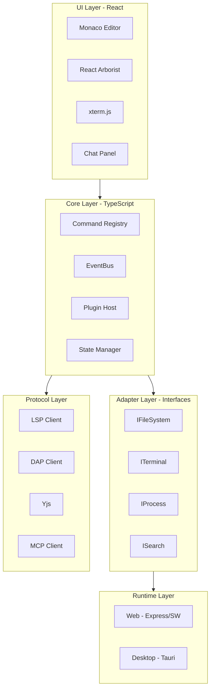

# Plano de Documentacao Estrategica Ultra-IDE v2.0

## AUTOCRITICA DO PLANO v1.0

### Falhas Identificadas

| Falha | Impacto | Correcao |

|-------|---------|----------|

| Foco em estrutura, nao em conteudo | Agente nao sabe O QUE escrever | Definir conteudo exato de cada secao |

| Sem padroes de codigo | Codigo inconsistente | Catalogo de padroes com exemplos |

| Sem templates praticos | Reinventar a roda | Templates copiaveis prontos |

| Sem checklists | Etapas esquecidas | Checklists para cada operacao |

| Extensibilidade abstrata | "Facil de estender" sem mostrar COMO | Guias passo-a-passo funcionais |

| Sem metricas | Impossivel medir sucesso | Indicadores mensuraveis |

| Sem troubleshooting | Problemas sem solucao | Catalogo de problemas/solucoes |

| Sem boundaries claros | Confusao de responsabilidades | Definir O QUE e de QUEM |

| Sem decisoes pendentes | Nao sabe o que falta decidir | Lista explicita |

| Sem onboarding estruturado | Agente novo demora entender | Sequencia de leitura definida |

---

## PRINCIPIO FUNDAMENTAL

> **Se um agente nao consegue implementar uma feature lendo APENAS a documentacao, a documentacao falhou.**

A documentacao deve ser:

- **Executavel**: Cada secao permite acao imediata
- **Completa**: Sem dependencia de conhecimento externo
- **Pratica**: Codigo funcional, nao teorico
- **Verificavel**: Criterios claros de sucesso

---

## ESTRUTURA DO DOCUMENTO MASTER

Arquivo: `ULTRA-IDE-MASTER-SPEC.md` (dentro de `docs/ultra-ide/`)

---

### SECAO 0: ONBOARDING RAPIDO

**Objetivo**: Agente novo entende o projeto em 5 minutos.

**Conteudo EXATO a escrever**:

```markdown
# ULTRA-IDE

## O QUE E

IDE hibrida (web + desktop) para desenvolvimento de sistemas complexos
com IA integrada, funcionando online ou offline.

## PROBLEMA QUE RESOLVE

- IDEs tradicionais sao pesadas e lentas
- Dependem de internet para IA
- Dificeis de estender
- Nao colaborativas

## DIFERENCIAL

- 10MB (vs 150MB Electron)
- IA offline via Ollama
- Extensivel via plugins seguros
- Colaboracao em tempo real (CRDT)

## STACK RESUMIDO

React 18 | Monaco | Tauri 2.x | LSP/DAP | Yjs | LiteLLM

## ESTADO ATUAL

[X] Planejamento concluido
[ ] Desenvolvimento iniciado
[ ] MVP funcional
[ ] Beta
[ ] Producao

## SEQUENCIA DE LEITURA

1. Esta secao (5 min)
2. Secao 1: Principios (10 min)
3. Secao 3: Arquitetura (15 min)
4. Secao relevante para sua tarefa

## PROXIMA ACAO

- Implementar feature? Va para Secao 6 (Templates)
- Sugerir mudanca? Va para Secao 2 (Criterios)
- Entender decisao? Va para Secao 3 (ADRs)
- Resolver problema? Va para Secao 10 (Troubleshooting)
```

---

### SECAO 1: PRINCIPIOS INEGOCIAVEIS

**Objetivo**: Definir O QUE NAO PODE MUDAR sem discussao explicita.

**Formato OBRIGATORIO para cada principio**:

```markdown
## PRINCIPIO: [Nome]

### Definicao
[Uma frase clara]

### Aplicacao Pratica
- Exemplo 1 de aplicacao
- Exemplo 2 de aplicacao

### Quando Violar
[Unica situacao onde e aceitavel]

### Como Medir
[Metrica objetiva]
```

**Principios a documentar**:

1. **Leveza sobre Features**

                                                                                                                                                                                                                                                                                                                                                                                                                                                                                                                                                                                                                                                                                                                                                                                                - Definicao: Preferir solucao leve mesmo com menos features
                                                                                                                                                                                                                                                                                                                                                                                                                                                                                                                                                                                                                                                                                                                                                                                                - Metrica: Bundle desktop < 50MB, web inicial < 5MB

2. **Estabilidade sobre Novidade**

                                                                                                                                                                                                                                                                                                                                                                                                                                                                                                                                                                                                                                                                                                                                                                                                - Definicao: Preferir tecnologia madura sobre bleeding-edge
                                                                                                                                                                                                                                                                                                                                                                                                                                                                                                                                                                                                                                                                                                                                                                                                - Metrica: Dependencias com > 6 meses de versao estavel

3. **Seguranca sobre Conveniencia**

                                                                                                                                                                                                                                                                                                                                                                                                                                                                                                                                                                                                                                                                                                                                                                                                - Definicao: Nunca comprometer seguranca por facilidade
                                                                                                                                                                                                                                                                                                                                                                                                                                                                                                                                                                                                                                                                                                                                                                                                - Metrica: Zero vulnerabilidades criticas, plugins sandboxed

4. **Extensibilidade sobre Monolito**

                                                                                                                                                                                                                                                                                                                                                                                                                                                                                                                                                                                                                                                                                                                                                                                                - Definicao: Preferir composicao sobre features embutidas
                                                                                                                                                                                                                                                                                                                                                                                                                                                                                                                                                                                                                                                                                                                                                                                                - Metrica: Toda feature nova pode ser plugin

5. **Offline-first**

                                                                                                                                                                                                                                                                                                                                                                                                                                                                                                                                                                                                                                                                                                                                                                                                - Definicao: Funcionar 100% sem internet
                                                                                                                                                                                                                                                                                                                                                                                                                                                                                                                                                                                                                                                                                                                                                                                                - Metrica: Todas features core funcionam offline

6. **Acessibilidade Obrigatoria**

                                                                                                                                                                                                                                                                                                                                                                                                                                                                                                                                                                                                                                                                                                                                                                                                - Definicao: WCAG 2.1 AA em toda UI
                                                                                                                                                                                                                                                                                                                                                                                                                                                                                                                                                                                                                                                                                                                                                                                                - Metrica: Audit score > 90

---

### SECAO 2: CRITERIOS DE DECISAO

**Objetivo**: Permitir que qualquer agente tome decisoes consistentes.

**2.1 Criterio: Escolha de Dependencia**

```markdown
## CHECKLIST: Avaliar Dependencia

### Obrigatorios (todos devem ser SIM)
- [ ] Licenca compativel? (MIT, Apache, BSD)
- [ ] Funciona em Linux E Windows?
- [ ] Tem TypeScript types?
- [ ] Atualizada nos ultimos 6 meses?

### Desejáveis (minimo 4/6)
- [ ] Mais de 1000 stars GitHub?
- [ ] Issues resolvidas ativamente?
- [ ] Documentacao completa?
- [ ] Bundle size aceitavel para o caso?
- [ ] Sem dependencias problematicas?
- [ ] Comunidade ativa (Discord/Forum)?

### Decisao
- Core: 4 obrigatorios + 5/6 desejaveis
- Plugin: 4 obrigatorios + 3/6 desejaveis
```

**2.2 Criterio: Aceitar Sugestao de Mudanca**

```markdown
## CHECKLIST: Avaliar Sugestao

- [ ] Justificada com base nos principios da Secao 1?
- [ ] Trade-offs documentados explicitamente?
- [ ] Compativel com arquitetura existente?
- [ ] Reversivel ou tem plano de migracao?
- [ ] Tem evidencia concreta (benchmark, caso de uso)?

### Decisao
- 5/5: Aceitar
- 4/5: Discutir
- < 4: Rejeitar com feedback
```

**2.3 Criterio: Adicionar Feature ao Core vs Plugin**

```markdown
## DECISAO: Core ou Plugin?

### Vai para CORE se:
- Necessario para 90%+ dos usuarios
- Depende de APIs internas nao expostas
- Critico para seguranca/estabilidade

### Vai para PLUGIN se:
- Especifico para caso de uso
- Pode ser implementado com Plugin API
- Opcional para maioria dos usuarios

### Exemplos
- Editor Monaco: CORE (essencial)
- Tema escuro: CORE (90%+ usa)
- GitHub integration: PLUGIN (nem todos usam)
- Suporte a Rust: PLUGIN (linguagem especifica)
```

---

### SECAO 3: ARQUITETURA E ADRs

**Objetivo**: Mostrar ONDE cada coisa fica, POR QUE, e historico de decisoes.

**3.1 Diagrama de Camadas**



**3.2 Responsabilidades por Camada**

| Camada | Responsavel por | NAO responsavel por |

|--------|-----------------|---------------------|

| UI | Renderizacao, eventos de usuario | Logica de negocio, acesso a FS |

| Core | Orquestracao, estado, comandos | Renderizacao, APIs de plataforma |

| Adapters | Abstracoes de plataforma | Implementacao concreta |

| Protocols | Comunicacao com servidores externos | UI, estado |

| Runtime | Implementacao especifica de plataforma | Logica de negocio |

**3.3 ADRs (Architecture Decision Records)**

Formato OBRIGATORIO:

```markdown
## ADR-XXX: [Titulo da Decisao]

### Status
[Proposta | Aceita | Deprecada | Substituida por ADR-YYY]

### Contexto
[Problema que precisava resolver]

### Decisao
[O que decidimos fazer]

### Justificativa
[Por que essa opcao e nao outra]

### Alternativas Consideradas
1. [Alternativa A]: [Por que rejeitada]
2. [Alternativa B]: [Por que rejeitada]

### Consequencias
- Positivas: [...]
- Negativas: [...]

### Reversibilidade
[ALTA | MEDIA | BAIXA] - [Explicacao]
```

**ADRs a documentar**:

- ADR-001: React sobre Solid.js
- ADR-002: Monaco sobre CodeMirror 6
- ADR-003: Tauri sobre Electron
- ADR-004: Zustand sobre Redux/Jotai
- ADR-005: Yjs sobre Automerge
- ADR-006: LiteLLM sobre OpenRouter
- ADR-007: pnpm sobre npm/yarn
- ADR-008: Vitest sobre Jest

---

### SECAO 4: CONTRATOS DE INTERFACE

**Objetivo**: Definir O QUE NAO PODE MUDAR sem versionamento.

**Formato OBRIGATORIO**:

```markdown
## INTERFACE: [Nome]

### Versao: X.Y.Z

### Regra de Versionamento
- MAJOR: Quebra assinatura existente
- MINOR: Adiciona metodo opcional
- PATCH: Fix sem mudanca de assinatura

### Definicao TypeScript

[Codigo TypeScript completo com JSDoc]

### Exemplo de Uso

[Codigo funcional demonstrando uso]

### Implementacoes

- [Plataforma]: [Caminho do arquivo]

### Testes de Contrato

[Caminho do arquivo de teste]
```

**Interfaces a documentar**:

1. **IFileSystem** (v1.0.0)
```typescript
interface IFileSystem {
  list(path: string): Promise<FileEntry[]>;
  read(path: string): Promise<Uint8Array>;
  write(path: string, content: Uint8Array): Promise<void>;
  delete(path: string): Promise<void>;
  exists(path: string): Promise<boolean>;
  stat(path: string): Promise<FileStat>;
  watch(glob: string, callback: WatchCallback): Disposable;
  createDirectory(path: string): Promise<void>;
  rename(oldPath: string, newPath: string): Promise<void>;
  copy(source: string, destination: string): Promise<void>;
}
```

2. **ITerminal** (v1.0.0)
3. **IProcess** (v1.0.0)
4. **ISearch** (v1.0.0)
5. **IGit** (v1.0.0)
6. **IBrowser** (v1.0.0)
7. **IStorage** (v1.0.0)
8. **PluginAPI** (v1.0.0)
9. **CommandRegistry** (v1.0.0)
10. **EventBus** (v1.0.0)

---

### SECAO 5: PADROES E ANTI-PADROES

**Objetivo**: Garantir codigo consistente e evitar erros comuns.

**Formato OBRIGATORIO para padrao**:

```markdown
## PADRAO: [Nome]

### Quando Usar
[Situacao onde se aplica]

### Implementacao Correta
[Codigo funcional completo]

### Por Que Assim
[Explicacao da escolha]

### Checklist de Validacao
- [ ] Item 1
- [ ] Item 2
```

**Formato OBRIGATORIO para anti-padrao**:

```markdown
## ANTI-PADRAO: [Nome]

### O Que E
[Descricao do erro]

### Por Que E Problema
[Consequencias]

### Codigo ERRADO
[Exemplo do que NAO fazer]

### Codigo CORRETO
[Como deveria ser]
```

**Padroes a documentar** (com codigo completo):

1. Adicionar novo comando
2. Criar componente UI
3. Criar adapter
4. Criar store Zustand
5. Registrar evento
6. Tratar erros
7. Fazer requisicao async
8. Persistir estado
9. Comunicar entre modulos
10. Criar plugin

**Anti-padroes a documentar**:

1. Acessar DOM fora de UI layer
2. Estado global mutavel sem store
3. Dependencia circular entre modulos
4. Ignorar erros silenciosamente
5. Hardcode de paths
6. Secrets em codigo
7. Callback hell
8. Props drilling excessivo
9. useEffect sem cleanup
10. Dependencias nao declaradas

---

### SECAO 6: TEMPLATES

**Objetivo**: Permitir criar novos componentes sem pensar em estrutura.

**Templates a incluir** (codigo completo copiavel):

**6.1 Template: Componente UI**

```typescript
// packages/ui/src/components/[Nome]/index.ts
export { [Nome] } from './[Nome]';
export type { [Nome]Props } from './types';

// packages/ui/src/components/[Nome]/[Nome].tsx
import { memo } from 'react';
import type { [Nome]Props } from './types';
import styles from './[Nome].module.css';

export const [Nome] = memo(function [Nome](props: [Nome]Props) {
  const { className, ...rest } = props;
  
  return (
    <div className={`${styles.root} ${className ?? ''}`} {...rest}>
      {/* conteudo */}
    </div>
  );
});

// packages/ui/src/components/[Nome]/types.ts
export interface [Nome]Props {
  className?: string;
  // outras props
}

// packages/ui/src/components/[Nome]/[Nome].test.tsx
import { render, screen } from '@testing-library/react';
import { [Nome] } from './[Nome]';

describe('[Nome]', () => {
  it('renders without crashing', () => {
    render(<[Nome] />);
    // assertions
  });
});
```

**6.2 Template: Adapter**

```typescript
// packages/core/src/adapters/I[Nome].ts
export interface I[Nome] {
  // metodos
}

// packages/web/src/adapters/Web[Nome].ts
import type { I[Nome] } from '@ultra-ide/core';

export class Web[Nome] implements I[Nome] {
  // implementacao web
}

// packages/desktop/src/adapters/Tauri[Nome].ts
import type { I[Nome] } from '@ultra-ide/core';
import { invoke } from '@tauri-apps/api/core';

export class Tauri[Nome] implements I[Nome] {
  // implementacao Tauri
}
```

**6.3 Template: Plugin**

```typescript
// plugins/plugin-[nome]/package.json
{
  "name": "@ultra-ide/plugin-[nome]",
  "version": "1.0.0",
  "main": "./dist/index.js",
  "ultra-ide": {
    "id": "[nome]",
    "name": "[Nome Display]",
    "version": "1.0.0",
    "apiVersion": "^1.0.0",
    "permissions": [],
    "activationEvents": []
  }
}

// plugins/plugin-[nome]/src/index.ts
import type { Plugin, PluginContext } from '@ultra-ide/core';

const plugin: Plugin = {
  async activate(ctx: PluginContext) {
    // registrar comandos, views, etc
  },
  
  async deactivate() {
    // cleanup
  }
};

export default plugin;
```

**6.4 Template: Store Zustand**

**6.5 Template: Comando**

**6.6 Template: Teste Unitario**

**6.7 Template: Teste E2E**

---

### SECAO 7: GUIAS DE EXTENSIBILIDADE

**Objetivo**: Mostrar EXATAMENTE como estender cada parte do sistema.

**Formato OBRIGATORIO**:

```markdown
## GUIA: [Tipo de Extensao]

### Pre-requisitos
[O que precisa saber/ter]

### Resultado Final
[O que tera ao terminar]

### Passo 1: [Titulo]
[Instrucao com codigo]

### Passo 2: [Titulo]
[Instrucao com codigo]

### Passo N: [Titulo]
[Instrucao com codigo]

### Testar
[Como verificar que funcionou]

### Checklist de Validacao
- [ ] Item 1
- [ ] Item 2

### Troubleshooting
[Problemas comuns e solucoes]
```

**Guias a criar** (todos com codigo funcional):

1. Adicionar suporte a nova linguagem (LSP)
2. Adicionar debugger para nova linguagem (DAP)
3. Adicionar novo provedor de IA
4. Criar integracao com servico externo
5. Adicionar novo tema
6. Criar plugin completo do zero
7. Adicionar novo tipo de view/panel
8. Adicionar novo comando com keybinding
9. Adicionar configuracao persistente
10. Adicionar snippets para linguagem

---

### SECAO 8: CHECKLISTS OPERACIONAIS

**Objetivo**: Garantir que nada seja esquecido em cada operacao.

**Checklists a criar**:

**8.1 Implementar Nova Feature**

```markdown
## CHECKLIST: Nova Feature

### Antes
- [ ] Feature aprovada/no roadmap?
- [ ] ADR criado se for decisao arquitetural?
- [ ] Dependencias aprovadas?
- [ ] Interface definida?

### Durante
- [ ] Seguiu template apropriado?
- [ ] Seguiu padroes documentados?
- [ ] Evitou anti-padroes?
- [ ] Tipos TypeScript completos?
- [ ] Tratamento de erros?
- [ ] Logging apropriado?
- [ ] Acessibilidade?

### Testes
- [ ] Testes unitarios?
- [ ] Testes de integracao?
- [ ] Coverage > 80%?

### Documentacao
- [ ] JSDoc em APIs publicas?
- [ ] Exemplo de uso?
- [ ] Changelog entry?

### Finalizacao
- [ ] Lint passou?
- [ ] Types passou?
- [ ] Testes passaram?
- [ ] Build passou?
```

**8.2 Criar Plugin**

**8.3 Adicionar Dependencia**

**8.4 Fazer Release**

**8.5 Revisar PR**

**8.6 Resolver Bug**

---

### SECAO 9: METRICAS DE SUCESSO

**Objetivo**: Medir objetivamente se metas foram atingidas.

**Formato**:

```markdown
## METRICA: [Nome do Objetivo]

### Indicadores

| Indicador | Target | Como Medir |
|-----------|--------|------------|
| [Nome] | [Valor] | [Metodo] |

### Atual
[Valor atual ou N/A]

### Historico
[Evolucao ao longo do tempo]
```

**Metricas a definir**:

1. **Sistema Leve**

                                                                                                                                                                                                                                                                                                                                                                                                                                                                                                                                                                                                                                                                                                                                                                                                - Bundle desktop < 50MB
                                                                                                                                                                                                                                                                                                                                                                                                                                                                                                                                                                                                                                                                                                                                                                                                - Bundle web inicial < 5MB
                                                                                                                                                                                                                                                                                                                                                                                                                                                                                                                                                                                                                                                                                                                                                                                                - Memoria RAM < 300MB idle

2. **Facil de Manter**

                                                                                                                                                                                                                                                                                                                                                                                                                                                                                                                                                                                                                                                                                                                                                                                                - Tempo para entender modulo < 30 min
                                                                                                                                                                                                                                                                                                                                                                                                                                                                                                                                                                                                                                                                                                                                                                                                - Coverage > 80% core
                                                                                                                                                                                                                                                                                                                                                                                                                                                                                                                                                                                                                                                                                                                                                                                                - Taxa de regressao < 5%

3. **Facil de Estender**

                                                                                                                                                                                                                                                                                                                                                                                                                                                                                                                                                                                                                                                                                                                                                                                                - Tempo para criar plugin basico < 4h
                                                                                                                                                                                                                                                                                                                                                                                                                                                                                                                                                                                                                                                                                                                                                                                                - Taxa de sucesso de plugins apos update > 90%

4. **Performance**

                                                                                                                                                                                                                                                                                                                                                                                                                                                                                                                                                                                                                                                                                                                                                                                                - Startup < 2s
                                                                                                                                                                                                                                                                                                                                                                                                                                                                                                                                                                                                                                                                                                                                                                                                - Abrir arquivo < 100ms
                                                                                                                                                                                                                                                                                                                                                                                                                                                                                                                                                                                                                                                                                                                                                                                                - Autocomplete < 200ms

5. **Acessibilidade**

                                                                                                                                                                                                                                                                                                                                                                                                                                                                                                                                                                                                                                                                                                                                                                                                - WCAG 2.1 AA
                                                                                                                                                                                                                                                                                                                                                                                                                                                                                                                                                                                                                                                                                                                                                                                                - Lighthouse accessibility > 90

---

### SECAO 10: TROUBLESHOOTING

**Objetivo**: Resolver problemas comuns rapidamente.

**Formato OBRIGATORIO**:

```markdown
## PROBLEMA: [Titulo]

### Sintomas
[O que o usuario ve]

### Causas Comuns

1. **[Causa 1]**
                                                                                                                                                                                                                                                   - Verificar: [Como verificar]
                                                                                                                                                                                                                                                   - Solucao: [O que fazer]

2. **[Causa 2]**
                                                                                                                                                                                                                                                   - Verificar: [Como verificar]
                                                                                                                                                                                                                                                   - Solucao: [O que fazer]

### Debug
[Passos para investigar]

### Ainda Nao Resolveu?
[Como reportar]
```

**Problemas a documentar**:

1. LSP nao conecta
2. DAP nao inicia sessao de debug
3. Terminal nao abre
4. Plugin nao ativa
5. Colaboracao nao sincroniza
6. Performance lenta
7. Crash ao abrir projeto grande
8. Build falha
9. Testes falham no CI
10. Hot reload nao funciona

---

### SECAO 11: DECISOES PENDENTES

**Objetivo**: Listar o que ainda precisa ser decidido.

**Formato**:

```markdown
## DP-XXX: [Titulo]

### Contexto
[Por que precisa decidir]

### Opcoes
A) [Opcao A]
B) [Opcao B]

### Criterios de Decisao
[O que considerar]

### Responsavel
[Quem vai decidir]

### Prazo
[Quando precisa decidir]

### Status
[Aguardando X | Em discussao | Decidido: ver ADR-YYY]
```

**Decisoes pendentes conhecidas**:

- DP-001: Estrategia de temas (CSS vars vs tokens)
- DP-002: Formato de configuracao (JSON vs TOML)
- DP-003: Estrategia de i18n
- DP-004: Modelo de pricing (se houver)
- DP-005: Nome final do produto

---

### SECAO 12: CHANGELOG

**Objetivo**: Rastrear mudancas no documento.

```markdown
## CHANGELOG

### [Data] - v[X.Y.Z]
- [Mudanca 1]
- [Mudanca 2]
```

---

## ARQUIVOS A CRIAR

| Arquivo | Conteudo |

|---------|----------|

| `ULTRA-IDE-MASTER-SPEC.md` | Documento master completo |

| `contracts/IFileSystem.ts` | Interface + JSDoc + exemplos |

| `contracts/ITerminal.ts` | Interface + JSDoc + exemplos |

| `contracts/PluginAPI.ts` | Interface + JSDoc + exemplos |

| `templates/component.md` | Template de componente UI |

| `templates/adapter.md` | Template de adapter |

| `templates/plugin.md` | Template de plugin |

| `templates/store.md` | Template de store Zustand |

| `patterns/commands.md` | Padrao de comandos |

| `patterns/error-handling.md` | Padrao de erros |

| `guides/add-language.md` | Guia LSP |

| `guides/add-debugger.md` | Guia DAP |

| `guides/add-ai-provider.md` | Guia AI |

| `guides/create-plugin.md` | Guia plugin |

| `troubleshooting/lsp.md` | Problemas LSP |

| `troubleshooting/dap.md` | Problemas DAP |

| `adrs/ADR-001-react.md` | Decisao React |

| `adrs/ADR-002-monaco.md` | Decisao Monaco |

| `adrs/ADR-003-tauri.md` | Decisao Tauri |

---

## VALIDACAO FINAL

Antes de considerar a documentacao pronta:

- [ ] Agente novo entende o projeto em 30 min?
- [ ] Agente implementa feature sem perguntar?
- [ ] Todas as interfaces tem tipos + exemplos?
- [ ] Todos os padroes tem codigo funcional?
- [ ] Todas as extensoes tem guia passo-a-passo?
- [ ] Problemas comuns estao documentados?
- [ ] Metricas de sucesso estao definidas e mensuraveis?
- [ ] Decisoes pendentes estao listadas?
- [ ] Templates sao copiaveis e funcionam?
- [ ] Checklists cobrem todas as operacoes?