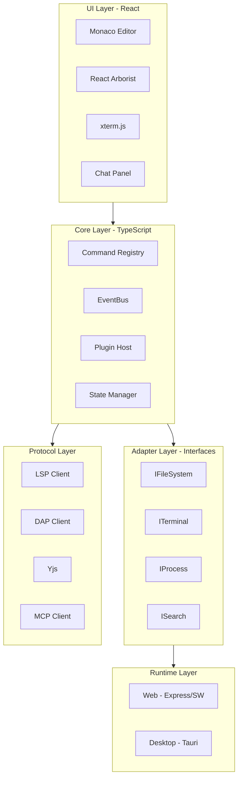

# ULTRA-IDE - Especificação Master

## SECAO 0: ONBOARDING RAPIDO

### O QUE E

IDE hibrida (web + desktop) para desenvolvimento de sistemas complexos
com IA integrada, funcionando online ou offline.

### PROBLEMA QUE RESOLVE

- IDEs tradicionais sao pesadas e lentas
- Dependem de internet para IA
- Dificeis de estender
- Nao colaborativas

### DIFERENCIAL

- 10MB (vs 150MB Electron)
- IA offline via Ollama
- Extensivel via plugins seguros
- Colaboracao em tempo real (CRDT)

### STACK RESUMIDO

React 18 | Monaco | Tauri 2.x | LSP/DAP | Yjs | LiteLLM

### ESTADO ATUAL

[X] Planejamento concluido
[ ] Desenvolvimento iniciado
[ ] MVP funcional
[ ] Beta
[ ] Producao

### SEQUENCIA DE LEITURA

1. Esta secao (5 min)
2. Secao 1: Principios (10 min)
3. Secao 3: Arquitetura (15 min)
4. Secao relevante para sua tarefa

### PROXIMA ACAO

- Implementar feature? Va para Secao 6 (Templates)
- Sugerir mudanca? Va para Secao 2 (Criterios)
- Entender decisao? Va para Secao 3 (ADRs)
- Resolver problema? Va para Secao 10 (Troubleshooting)

---

## SECAO 1: PRINCIPIOS INEGOCIAVEIS

### PRINCIPIO: Leveza sobre Features

#### Definicao
Preferir solucao leve mesmo com menos features.

#### Aplicacao Pratica
- Escolhemos Tauri (10MB) sobre Electron (150MB)
- Rejeitamos biblioteca X porque adiciona 500KB sem necessidade
- Preferimos feature flag para funcionalidades opcionais

#### Quando Violar
Apenas se feature for CRITICA para 90%+ dos usuarios e nao existir alternativa leve.

#### Como Medir
- Bundle desktop < 50MB
- Bundle web inicial < 5MB
- Memoria RAM < 300MB idle

---

### PRINCIPIO: Estabilidade sobre Novidade

#### Definicao
Preferir tecnologia madura sobre bleeding-edge.

#### Aplicacao Pratica
- Usamos React 18 (estavel) em vez de React 19 (experimental)
- Preferimos versoes LTS de dependencias
- Evitamos bibliotecas com menos de 6 meses de versao estavel

#### Quando Violar
Quando tecnologia nova resolve problema critico sem alternativa madura, mas com plano de migracao.

#### Como Medir
- Dependencias com > 6 meses de versao estavel
- Zero dependencias em versao alpha/beta
- Testes de regressao passando

---

### PRINCIPIO: Seguranca sobre Conveniencia

#### Definicao
Nunca comprometer seguranca por facilidade.

#### Aplicacao Pratica
- Plugins sempre sandboxed (WebWorker)
- Nenhum eval() ou Function() sem sanitizacao
- Secrets nunca em codigo ou logs
- Validação de entrada em todas as APIs

#### Quando Violar
Nunca. Seguranca e inegociavel.

#### Como Medir
- Zero vulnerabilidades criticas
- Todos os plugins sandboxed
- Audit de seguranca passando
- Rate limiting em todas as APIs

---

### PRINCIPIO: Extensibilidade sobre Monolito

#### Definicao
Preferir composicao sobre features embutidas.

#### Aplicacao Pratica
- GitHub integration como plugin, nao core
- Suporte a linguagens via plugins LSP
- Temas via sistema de plugins
- Features opcionais sempre como plugins

#### Quando Violar
Quando feature e essencial para 90%+ dos usuarios e requer APIs internas nao expostas.

#### Como Medir
- Toda feature nova pode ser plugin
- Plugin API completa e documentada
- Marketplace de plugins funcional

---

### PRINCIPIO: Offline-first

#### Definicao
Funcionar 100% sem internet.

#### Aplicacao Pratica
- Ollama para IA local
- Service Workers para cache web
- IndexedDB/SQLite para estado persistente
- Todas features core funcionam offline

#### Quando Violar
Apenas para features explicitamente online (ex: GitHub sync, cloud backup).

#### Como Medir
- Todas features core funcionam offline
- Testes de desconexao passando
- Cache estrategico implementado

---

### PRINCIPIO: Acessibilidade Obrigatoria

#### Definicao
WCAG 2.1 AA em toda UI.

#### Aplicacao Pratica
- ARIA labels em todos componentes
- Navegacao por teclado completa
- Contraste de cores adequado
- Screen reader support

#### Quando Violar
Nunca. Acessibilidade e direito, nao opcao.

#### Como Medir
- Lighthouse accessibility > 90
- Audit WCAG 2.1 AA passando
- Testes com screen readers

---

## SECAO 2: CRITERIOS DE DECISAO

### CHECKLIST: Avaliar Dependencia

#### Obrigatorios (todos devem ser SIM)
- [ ] Licenca compativel? (MIT, Apache, BSD)
- [ ] Funciona em Linux E Windows?
- [ ] Tem TypeScript types?
- [ ] Atualizada nos ultimos 6 meses?

#### Desejáveis (minimo 4/6)
- [ ] Mais de 1000 stars GitHub?
- [ ] Issues resolvidas ativamente?
- [ ] Documentacao completa?
- [ ] Bundle size aceitavel para o caso?
- [ ] Sem dependencias problematicas?
- [ ] Comunidade ativa (Discord/Forum)?

#### Decisao
- Core: 4 obrigatorios + 5/6 desejaveis
- Plugin: 4 obrigatorios + 3/6 desejaveis

---

### CHECKLIST: Avaliar Sugestao

- [ ] Justificada com base nos principios da Secao 1?
- [ ] Trade-offs documentados explicitamente?
- [ ] Compativel com arquitetura existente?
- [ ] Reversivel ou tem plano de migracao?
- [ ] Tem evidencia concreta (benchmark, caso de uso)?

#### Decisao
- 5/5: Aceitar
- 4/5: Discutir
- < 4: Rejeitar com feedback

---

### DECISAO: Core ou Plugin?

#### Vai para CORE se:
- Necessario para 90%+ dos usuarios
- Depende de APIs internas nao expostas
- Critico para seguranca/estabilidade

#### Vai para PLUGIN se:
- Especifico para caso de uso
- Pode ser implementado com Plugin API
- Opcional para maioria dos usuarios

#### Exemplos
- Editor Monaco: CORE (essencial)
- Tema escuro: CORE (90%+ usa)
- GitHub integration: PLUGIN (nem todos usam)
- Suporte a Rust: PLUGIN (linguagem especifica)

---

## SECAO 3: ARQUITETURA E ADRs

### Diagrama de Camadas

### Responsabilidades por Camada

| Camada | Responsavel por | NAO responsavel por |
|--------|-----------------|---------------------|
| UI | Renderizacao, eventos de usuario | Logica de negocio, acesso a FS |
| Core | Orquestracao, estado, comandos | Renderizacao, APIs de plataforma |
| Adapters | Abstracoes de plataforma | Implementacao concreta |
| Protocols | Comunicacao com servidores externos | UI, estado |
| Runtime | Implementacao especifica de plataforma | Logica de negocio |

### ADRs (Architecture Decision Records)

Ver arquivos em [adrs/](./adrs/):
- [ADR-001: React sobre Solid.js](./adrs/ADR-001-react.md)
- [ADR-002: Monaco sobre CodeMirror 6](./adrs/ADR-002-monaco.md)
- [ADR-003: Tauri sobre Electron](./adrs/ADR-003-tauri.md)
- [ADR-004: Zustand sobre Redux/Jotai](./adrs/ADR-004-zustand.md)
- [ADR-005: Yjs sobre Automerge](./adrs/ADR-005-yjs.md)
- [ADR-006: LiteLLM sobre OpenRouter](./adrs/ADR-006-litellm.md)
- [ADR-007: pnpm sobre npm/yarn](./adrs/ADR-007-pnpm.md)
- [ADR-008: Vitest sobre Jest](./adrs/ADR-008-vitest.md)

---

## SECAO 4: CONTRATOS DE INTERFACE

Todas as interfaces estao documentadas em [contracts/](./contracts/) com:
- Definicao TypeScript completa
- JSDoc detalhado
- Exemplos de uso
- Testes de contrato

Interfaces principais:
- [IFileSystem](./contracts/IFileSystem.ts)
- [ITerminal](./contracts/ITerminal.ts)
- [IProcess](./contracts/IProcess.ts)
- [ISearch](./contracts/ISearch.ts)
- [IGit](./contracts/IGit.ts)
- [IBrowser](./contracts/IBrowser.ts)
- [IStorage](./contracts/IStorage.ts)
- [CommandRegistry](./contracts/CommandRegistry.ts)
- [EventBus](./contracts/EventBus.ts)
- [PluginAPI](./contracts/PluginAPI.ts)

---

## SECAO 5: PADROES E ANTI-PADROES

Padroes documentados em [patterns/](./patterns/):
- [commands.md](./patterns/commands.md) - Como adicionar comandos
- [error-handling.md](./patterns/error-handling.md) - Como tratar erros
- [component-creation.md](./patterns/component-creation.md) - Como criar componentes
- [adapter-creation.md](./patterns/adapter-creation.md) - Como criar adapters
- [store-creation.md](./patterns/store-creation.md) - Como criar stores
- [event-registration.md](./patterns/event-registration.md) - Como registrar eventos
- [async-request.md](./patterns/async-request.md) - Como fazer requisicoes async
- [persistence.md](./patterns/persistence.md) - Como persistir estado
- [module-communication.md](./patterns/module-communication.md) - Comunicacao entre modulos
- [plugin-creation.md](./patterns/plugin-creation.md) - Criar plugin

Anti-padroes documentados nos mesmos arquivos:
- Acessar DOM fora de UI layer
- Estado global mutavel sem store
- Dependencia circular entre modulos
- Ignorar erros silenciosamente
- Hardcode de paths
- Secrets em codigo

---

## SECAO 6: TEMPLATES

Templates copiaveis em [templates/](./templates/):
- [component.md](./templates/component.md) - Template de componente UI
- [adapter.md](./templates/adapter.md) - Template de adapter
- [plugin.md](./templates/plugin.md) - Template de plugin
- [store.md](./templates/store.md) - Template de store Zustand
- [command.md](./templates/command.md) - Template de comando
- [test-unit.md](./templates/test-unit.md) - Template de teste unitario
- [test-e2e.md](./templates/test-e2e.md) - Template de teste E2E

---

## SECAO 7: GUIAS DE EXTENSIBILIDADE

Guias passo-a-passo em [guides/](./guides/):
- [add-language.md](./guides/add-language.md) - Adicionar suporte a nova linguagem (LSP)
- [create-plugin.md](./guides/create-plugin.md) - Criar plugin completo do zero
- [add-ai-provider.md](./guides/add-ai-provider.md) - Adicionar novo provedor de IA
- [add-debugger.md](./guides/add-debugger.md) - Adicionar debugger para nova linguagem (DAP)
- [add-view.md](./guides/add-view.md) - Adicionar novo tipo de view/panel
- [add-command.md](./guides/add-command.md) - Adicionar novo comando com keybinding
- [add-config.md](./guides/add-config.md) - Adicionar configuracao persistente
- [add-snippets.md](./guides/add-snippets.md) - Adicionar snippets para linguagem

---

## SECAO 8: CHECKLISTS OPERACIONAIS

### CHECKLIST: Nova Feature

#### Antes
- [ ] Feature aprovada/no roadmap?
- [ ] ADR criado se for decisao arquitetural?
- [ ] Dependencias aprovadas?
- [ ] Interface definida?

#### Durante
- [ ] Seguiu template apropriado?
- [ ] Seguiu padroes documentados?
- [ ] Evitou anti-padroes?
- [ ] Tipos TypeScript completos?
- [ ] Tratamento de erros?
- [ ] Logging apropriado?
- [ ] Acessibilidade?

#### Testes
- [ ] Testes unitarios?
- [ ] Testes de integracao?
- [ ] Coverage > 80%?

#### Documentacao
- [ ] JSDoc em APIs publicas?
- [ ] Exemplo de uso?
- [ ] Changelog entry?

#### Finalizacao
- [ ] Lint passou?
- [ ] Types passou?
- [ ] Testes passaram?
- [ ] Build passou?

---

### CHECKLIST: Criar Plugin

#### Antes
- [ ] Plugin necessario e aprovado?
- [ ] Permissoes minimas definidas?
- [ ] API version compatível?

#### Durante
- [ ] Manifest valido
- [ ] Activation events definidos
- [ ] Comandos registrados
- [ ] UI registrada (se aplicavel)
- [ ] Cleanup em deactivate

#### Testes
- [ ] Testes basicos de ativacao
- [ ] Teste de permissao

---

### CHECKLIST: Adicionar Dependencia

- [ ] Passa nos criterios de dependencia (Secao 2)
- [ ] Licenca compativel
- [ ] Bundle size aceitavel
- [ ] Sem vulnerabilidades criticas
- [ ] Documentacao atualizada

---

### CHECKLIST: Fazer Release

- [ ] Versao atualizada (semver)
- [ ] Changelog atualizado
- [ ] Tests e build passaram
- [ ] Documentacao atualizada
- [ ] Tag criada no git

---

### CHECKLIST: Revisar PR

- [ ] Codigo segue padroes
- [ ] Sem regressao aparente
- [ ] Testes adicionados/atualizados
- [ ] Documentacao atualizada
- [ ] Mudanca justificada nos ADRs (se necessario)

---

### CHECKLIST: Resolver Bug

- [ ] Reproduziu o problema
- [ ] Identificou causa raiz
- [ ] Corrigiu com test
- [ ] Teste falha antes e passa depois
- [ ] Documentacao atualizada se necessario

---

## SECAO 9: METRICAS DE SUCESSO

### METRICA: Sistema Leve

| Indicador | Target | Como Medir |
|-----------|--------|------------|
| Bundle desktop | < 50MB | Analise de bundle |
| Bundle web inicial | < 5MB | Lighthouse |
| Memoria RAM idle | < 300MB | Task Manager |

### METRICA: Facil de Manter

| Indicador | Target | Como Medir |
|-----------|--------|------------|
| Tempo para entender modulo | < 30 min | Pesquisa com novos contribuidores |
| Coverage core | > 80% | Vitest coverage report |
| Taxa de regressao | < 5% | Issues tagadas como regression |

### METRICA: Facil de Estender

| Indicador | Target | Como Medir |
|-----------|--------|------------|
| Tempo para criar plugin basico | < 4h | Teste com desenvolvedores |
| Taxa de sucesso de plugins apos update | > 90% | Testes automaticos |

### METRICA: Performance

| Indicador | Target | Como Medir |
|-----------|--------|------------|
| Startup | < 2s | Performance.now() |
| Abrir arquivo | < 100ms | Performance API |
| Autocomplete | < 200ms | LSP timing |

### METRICA: Acessibilidade

| Indicador | Target | Como Medir |
|-----------|--------|------------|
| WCAG 2.1 AA | Pass | Audit automatizado |
| Lighthouse accessibility | > 90 | Lighthouse CI |

---

## SECAO 10: TROUBLESHOOTING

Problemas comuns documentados em [troubleshooting/](./troubleshooting/):
- [lsp.md](./troubleshooting/lsp.md) - Problemas com LSP
- [dap.md](./troubleshooting/dap.md) - Problemas com DAP
- [plugins.md](./troubleshooting/plugins.md) - Problemas com plugins
- [terminal.md](./troubleshooting/terminal.md) - Problemas com terminal
- [collaboration.md](./troubleshooting/collaboration.md) - Problemas com colaboracao
- [performance.md](./troubleshooting/performance.md) - Problemas de performance
- [build.md](./troubleshooting/build.md) - Problemas de build
- [tests.md](./troubleshooting/tests.md) - Problemas com testes

---

## SECAO 11: DECISOES PENDENTES

### DP-001: Estrategia de Temas

#### Contexto
Como permitir temas customizados?

#### Opcoes
A) CSS variables apenas
B) Theme provider com tokens
C) Tailwind com config

#### Criterios de Decisao
- Performance
- Facilidade de criar tema
- Compatibilidade com Monaco

#### Status
Aguardando prototipo

---

### DP-002: Formato de Configuracao

#### Contexto
JSON, TOML, YAML para configs?

#### Opcoes
A) JSON (simples, sem comentarios)
B) JSON5 (com comentarios)
C) TOML (legivel, tipado)

#### Status
Aguardando discussao

---

### DP-003: Estrategia de i18n

#### Contexto
Como implementar internacionalizacao?

#### Opcoes
A) i18next
B) react-intl
C) Custom solution

#### Status
Aguardando decisao

---

## SECAO 12: CHANGELOG

### 2026-01-16 - v1.0.0
- Criacao inicial do documento master
- Definicao de stack tecnologico
- Definicao de arquitetura
- Documentacao de principios e criterios

---

## SECAO 13: GLOSSARIO

Termos e definicoes em [GLOSSARIO.md](./GLOSSARIO.md).

---

## SECAO 14: META (Como usar e atualizar este documento)

### Como usar

1. Leia a Secao 0 para contexto rapido
2. Consulte Principios e Criterios antes de decidir algo
3. Use Templates e Guias para implementar
4. Valide com Checklists antes de finalizar

### Como atualizar

- Toda mudanca arquitetural deve gerar um ADR
- Mudancas de API exigem atualizar contratos e exemplos
- Mudancas de processo exigem atualizar checklists
- Atualize o changelog ao modificar este documento

---

## REFERENCIAS

- [README da Documentacao](./README.md) - Visao geral da estrutura
- [Glossario](./GLOSSARIO.md) - Termos e definicoes
- [Contratos de Interface](./contracts/) - Interfaces TypeScript documentadas
- [Templates](./templates/) - Templates copiaveis
- [Padroes](./patterns/) - Padroes e anti-padroes
- [Guias](./guides/) - Guias de extensibilidade
- [ADRs](./adrs/) - Decisoes arquiteturais
- [Troubleshooting](./troubleshooting/) - Problemas e solucoes

## VALIDACAO

Este documento foi criado seguindo o plano em [PLANO_DOCUMENTACAO.md](./PLANO_DOCUMENTACAO.md).

Para validar completude:
- [x] Secao 0: Onboarding criada
- [x] Secao 1: Principios documentados
- [x] Secao 2: Criterios definidos
- [x] Secao 3: Arquitetura e ADRs criados
- [x] Secao 4: Contratos de interface criados
- [x] Secao 5: Padroes documentados
- [x] Secao 6: Templates criados
- [x] Secao 7: Guias de extensibilidade criados
- [x] Secao 8: Checklists operacionais criados
- [x] Secao 9: Metricas definidas
- [x] Secao 10: Troubleshooting documentado
- [x] Secao 11: Decisoes pendentes listadas
- [x] Secao 12: Changelog criado
